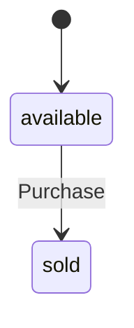
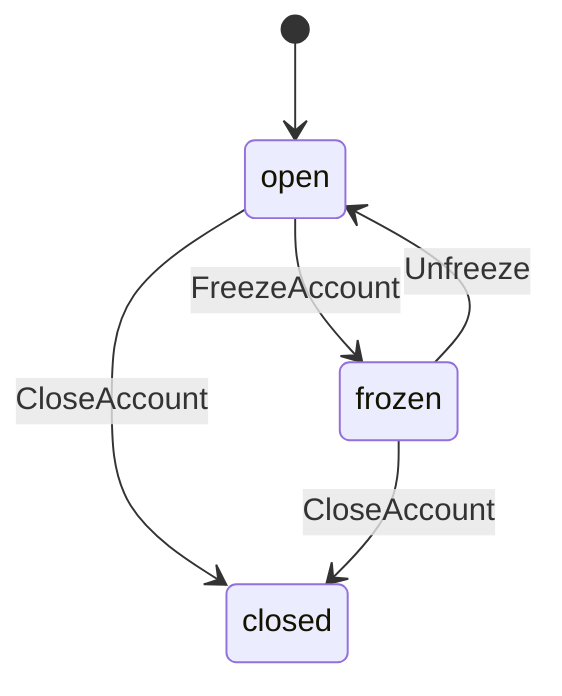

# hecks

hecks is an **executable domain specification language**. A `.bluebook`
file declares a business domain — its aggregates, rules, and events —
and that declaration *is* the running system, not a spec that code is
later written from:

```ruby skip
given("at most 10 toppings") { toppings.size < 10 }

sets :toppings, append: { name: :topping, amount: :amount }

emits "ToppingAdded"
```

`given` refuses a command before it runs; `sets` is the only way state
changes; `emits` is the only way anything downstream finds out. There
is no handler body behind those three lines — the runtime dispatches
directly from the declaration. A domain is data, so it can be read,
diffed, statically checked, run against generated fuzz sequences, and
compiled into another language, the same way any other data can.

<!-- doctest:boot
Kernel.load(File.join(InMemoryDomain::ROOT, "examples/pizzas/bluebook/pizzas.bluebook"))
Hecks.hecksagon("Pizzas") do
  uses_framework "Governance"
  Pizzas::Order.persisted_by("Memory")
end
Hecks.hecksagon("Governance") do
  Governance::RoleAssignment.persisted_by("Memory")
  Governance::RoleTransition.persisted_by("Memory")
end
-->

```ruby
order = Order.create_pizza!(name: { value: "Margherita" }, pizza: { price_cents: { cents: 1200 }, size: { value: "large" } })
order.add_topping!(topping: { value: "Basil" }, amount: { value: 3 })
order.purchase!(customer_name: { value: "Chris" }, amount: { cents: 1200 })

order.status             # => "sold"
order.events.last.name   # => "PizzaPurchased"
```

That block runs on every push, claims and all — not an illustration.
So does every other `ruby`-fenced example in this README and in
[the guides](docs/implemented/guides/); `spec/guides_spec.rb` is the
harness.

**Status:** `1.0.0`. See [Project status](#project-status) for what the
1.0 stability promise covers and what it explicitly doesn't yet.

## Install

```sh
gem install hecks
```

Or in a Gemfile: `gem "hecks"`. See [Quickstart](#quickstart) below to
go from a bare install to a running domain.

## Why

Take one real rule — "a pizza may carry at most 10 toppings." In a
conventional application that rule tends to end up in several places at
once: a check in the request handler, maybe a mirror of it in a
client-side form, an ORM validation or a database constraint, a line in
a test fixture asserting the boundary. Each copy is correct on its own.
None of them is *the* rule — the rule is whatever the union of all four
happens to enforce on a given day, and it drifts the moment one of them
is touched without the others.

In hecks that rule is written once, on the command that can violate it:

```ruby skip
given("at most 10 toppings") { toppings.size < 10 }
```

There is exactly one place this can be checked, because there is
exactly one path a command can take to reach state — every dispatch
walks the same fixed order (refuse unknown/missing arguments, check
role, enforce every `given`, apply the mutation, enforce every
`ensures`, persist, emit), for every command, in every domain. A rule
that is checked once, in the one place a violation can occur, cannot
quietly stop being checked somewhere.

Generalize that from one rule to a whole domain and the shape of the
bet becomes: **the business specification should be the durable
artifact, and the implementation running it should be the disposable
one.** A traditional stack reads roughly as

```
business requirement → developer/AI interpretation → application code → framework/runtime
```

— four lossy translations between the rule and the thing enforcing it,
each one a place the two can diverge. hecks collapses the middle two:

```
business domain → bluebook (explicit, constrained specification) → validated semantics → runtime/adapter
```

The specification is what a reviewer reads to know what the business
actually requires; it is also, unmodified, what runs. Swapping the
runtime underneath it — a different persistence adapter, a different
dispatch language entirely — does not touch the specification at all
(see [Projections](#projections-rust-and-webassembly)).

This is not a hypothetical concern about hecks's own corpus. [ADR
0025](docs/decisions/0025-the-dsl-names-one-idea-one-way-and-a-word-earns-its-place-by-being-used.md)
in this repository's own decision log measured it directly: two
preconditions — "the customer is active" and "the customer is not
closed" — had been independently typed out, worded slightly
differently each time, across **44% of all 183 `given` clauses** in
the corpus, because nothing made the duplication visible until someone
counted. The fix wasn't a linter; it was a language feature
(`given("customer is active")`, declared once and referenced by name
elsewhere) that makes the *duplication itself* impossible to write by
accident.

### Why this gets sharper with AI-generated code

Generating code has become cheap. Reviewing an ever-growing,
arbitrary codebase for architectural drift, duplicated business rules,
and quietly-diverging invariants has not gotten any cheaper, and an AI
agent editing that codebase inherits the same problem a human
maintainer has: it has to hold thousands of implementation details in
mind to avoid breaking one while fixing another, and nothing stops it
from re-deriving "at most 10 toppings" a fifth way in a fifth file.

hecks's bet is narrower and more mechanical than "AI will manage
complexity for you": constrain what gets modified — by a human or an
agent — to a small, closed, checked vocabulary (`aggregate`, `command`,
`given`, `sets`, `emits`, and a couple dozen more), and let the
compiler and runtime carry the burden of architectural consistency that
would otherwise depend on whoever (or whatever) is editing the code
noticing it. A bluebook that violates an invariant refuses to boot or
refuses to dispatch, deterministically, regardless of whether a person
or a model wrote the line. See [AI-native
development](#ai-native-development) for what that looks like as a
concrete integration today, not just an argument.

## How it works

A domain is three files, each with one job. `.bluebook` declares what
the domain *is* — aggregates, commands, rules — independent of how any
deployment runs it. `.hecksagon` wires it to real ports: which adapter
persists it, which framework it attaches to. `.world` holds the one
thing neither of those names — per-deployment values, like a database
URL. [Wiring](docs/implemented/guides/wiring.md) covers the last two in
full; here is the first, in full — `examples/pizzas/bluebook/pizzas.bluebook`,
trimmed to fit:

```ruby skip
aggregate "Order" do
  identified_by :name

  attribute :name,     PizzaName
  attribute :toppings, list_of(Topping)

  value_object "PizzaName" do
    attribute :value, String
    invariant("a pizza is named") { !value.to_s.empty? }
  end

  value_object "Topping" do
    attribute :name,   String
    attribute :amount, Integer
  end

  lifecycle :status, default: "available" do
    transition "Purchase" => "sold", from: "available"
  end

  command "CreatePizza" do
    role "Chef"
    attribute :name,  PizzaName
    attribute :pizza, Pizza
    emits "PizzaCreated"
  end

  command "AddTopping" do
    role "Chef"
    reference_to Order
    attribute :topping, ToppingName
    attribute :amount, ToppingAmount

    given("a sold pizza cannot be changed") { status == "available" }
    given("at most 10 toppings")            { toppings.size < 10 }

    sets :toppings, append: { name: :topping, amount: :amount }
    emits "ToppingAdded"
  end
end
```

An aggregate is the thing with identity — two orders named
`"Margherita"` *are* the same order, which is exactly what
`identified_by :name` declares. A value object has none; a `PizzaName`
is only its value, and its invariant travels with the value everywhere
it goes. The lifecycle names the states an order may hold and the
transitions between them. A command says three things and no more:
what it needs, what it refuses (`given`), what it announces (`emits`).

Nothing here is hand-drawn either — the same declaration draws its own
diagrams:

<!-- generated:begin id=diagrams -->
`bin/project_diagrams` reads a booted domain's own declaration and draws it as Mermaid — nine kinds so far: `<Name>_lifecycle.mmd`, `relationships.mmd`, `dispatch.mmd`, `roles.mmd`, `ports.mmd`, `read_models.mmd`, `<Name>_surface.mmd` (what a command does, and what it writes), `<Name>_saga.mmd`, and `frameworks.mmd`. Nothing hand-drawn — the same reason a domain is data at all. Order's own lifecycle, straight off the bluebook above:



The full set for every domain in this checkout — `examples/pizzas`, `examples/banking` — lives in [`docs/generated/diagrams/`](docs/generated/diagrams/), held to the declaration by `spec/diagrams_spec.rb` the same drift-refusing way this page is held to its own source.
<!-- generated:end -->

The expression inside `given`/`ensures`/`invariant` is Ruby, parsed by
Prism and reduced to canonical text stored alongside the rest of the
IR — the same reason the domain as a whole is data rather than code —
and its grammar is small and closed for the same reason: an operator
is admitted only once it earns its place rendering a real rule already
in the corpus. Full grammar and dispatch order in [Running a
runtime](docs/implemented/guides/running-a-runtime.md).

## Example: a business workflow

Pizzas is deliberately small. This is `examples/banking` — trimmed
here to one aggregate, the untrimmed original is
`examples/banking/bluebook/`:

```ruby bluebook
Hecks.bluebook "Banking" do
  vision "Customers hold accounts, accounts move money, and every movement is a transfer that can fail halfway. The domain that has to get it right twice — once in the rules, once in the recovery."
  core

  aggregate "Account" do
    identified_by :number

    attribute :number,  AccountNumber
    attribute :balance, Money

    value_object "AccountNumber" do
      attribute :value, String
      invariant("an account number is present") { !value.to_s.empty? }
    end

    value_object "Money" do
      attribute :cents,    Integer, default: 0
      attribute :currency, String,  default: "USD"

      invariant("a currency is a three-letter code") { currency.to_s.size == 3 }
    end

    value_object "PositiveMoney" do
      attribute :cents,    Integer
      attribute :currency, String, default: "USD"

      invariant("an amount is positive") { cents.positive? }
      invariant("a currency is a three-letter code") { currency.to_s.size == 3 }
    end

    lifecycle :status, default: "open" do
      transition "FreezeAccount" => "frozen", from: "open"
    end

    command "Open" do
      role "Branch clerk"
      attribute :number, AccountNumber
      sets :number
      emits "AccountOpened"
    end

    command "Credit" do
      role "Teller"
      reference_to Account
      attribute :amount, PositiveMoney

      given("the account is open") { status == "open" }
      sets :balance, increment: :amount
      emits "AccountCredited"
    end
  end
end
```

```ruby boot
Hecks.hecksagon("Banking") do
  uses_framework "Governance"
  Banking::Account.persisted_by("Memory")
end
Hecks.hecksagon("Governance") do
  Governance::RoleAssignment.persisted_by("Memory")
  Governance::RoleTransition.persisted_by("Memory")
end
```

An aggregate, a lifecycle, an invariant, a command, an event — executed:

```ruby
account = Account.open!(number: { value: "1001" })
account.credit!(amount: { cents: 500, currency: "USD" })

account.balance.to_h                                       # => { cents: 500, currency: "USD" }
account.credit!(amount: { cents: -1, currency: "USD" })    # ~> InvariantViolation: an amount is positive
```

The real `Account` — the one in `examples/banking/bluebook/`, not the
trimmed one above — is where the "one rule, checked once" argument from
[Why](#why) stops being a toy example. Six different commands can move
its `balance`; "the balance never goes negative" used to be three
different `given`/`ensures` clauses, worded differently, with two
commands that could only *increase* the balance saying nothing at all
— correctness depended on someone noticing which commands could
decrease it. It is now one aggregate-level `invariant`, checked after
every one of those six commands, stated once:

```ruby skip
# examples/banking/bluebook/deposit_accounts.bluebook — the real Account
invariant("the balance never goes negative") { balance.cents >= 0 }

command "Debit", from: "open" do
  role "Teller"
  reference_to Account
  attribute :amount, PositiveMoney

  given("customer is active")
  given("the balance covers it")     { balance.cents >= amount.cents }
  given("the daily limit allows it") { daily_limit.cents >= amount.cents }

  sets :balance, decrement: :amount
  sets :ledger,  append: { amount: :amount, narrative: :narrative, direction: { value: "debit" } }

  # "no debit leaves the balance negative" — GONE, not reworded: the
  # aggregate's own invariant above says it now.
  ensures("the balance fell by exactly the amount") { old.balance.cents == balance.cents + amount.cents }

  emits "AccountDebited"
end
```

`Account`'s own lifecycle, drawn from that same real declaration —
another aggregate, another set of states, nothing hand-drawn here either:



## Why this architecture matters

Only what this repository actually does today, checked, not aspired to:

- **Explicit semantics.** Every effect a command may cause is one of a
  closed set of declared verbs (`sets`, `increment`/`decrement`,
  `append`); every refusal is a named `given` or invariant. There is no
  code path that mutates state outside `sets`.
- **Static verification.** `bin/model_check` runs structural analysis
  over a domain's own IR — unreachable lifecycle states, transitions
  nothing can fire, saga states no handler chain reaches — before
  anything boots against real data.
- **Property-based fuzzing, including determinism.** `bin/fuzz`
  generates random-but-valid command/query sequences from a domain's
  own IR and checks four properties: every lifecycle value a replay
  produces was declared, every saga advance follows a declared handler,
  query answers match a reference implementation, and — the one that
  actually matters for an event-sourced system — **replaying the same
  steps against a fresh boot produces byte-identical history.** This
  runs against the Memory adapter only today; Sqlite and Postgres are
  not yet covered (tracked in
  [`docs/future-features.md`](docs/future-features.md)).
- **A corpus that checks its own refusals.** `spec/corpus/*.json`
  scripts real command/query sequences — successes and refusals both —
  replayed by `bin/run` and pinned by `spec/corpus_spec.rb`; a runtime
  that *accepts* what the corpus says must be refused is the failure
  that matters more than one that rejects a valid command.
- **Event-oriented by construction.** `emits` is the only way anything
  outside a command's own aggregate learns what happened; every emitted
  event is durably recorded, not just returned to the caller.
- **Runtime and adapter separation.** `persisted_by` in a `.hecksagon`
  file is the entire migration between an in-memory adapter and a real
  database — the `.bluebook` file never names a backend, so it never
  changes. `Memory`, `Sqlite`, `Postgres`, `PostgresEra` (adds
  schema-evolution tracking — see [Schema
  evolution](docs/implemented/guides/schema-evolution.md)), and `Heki`
  (an append-only journal, no server) all satisfy the same persistence
  port.

The same separation extends past persistence, to dispatch itself —
which is the more interesting claim, and where it currently matters
most:

## Projections: Rust and WebAssembly

The point is not "hecks also supports Rust." It's that the bluebook is
the one authoritative definition of a domain, and everything else —
including *where code runs* — is a **projection** of that definition,
generated, not hand-maintained a second time.

```
.bluebook  →  canonical IR  →  generated Rust source  →  native binary
                                                       →  WASM (WASI or browser)
```

`bin/project_rust <domain>` reads a booted domain's canonical IR and
generates typed Rust structs and enums for every value object, entity,
and aggregate record. `given`/`ensures`/mutation logic stays data,
interpreted at runtime by one small, hand-written kernel
(`rust/src/kernel/{expr,dispatch}.rs`) that walks it exactly the way
`CommandInterpreter#call` does in Ruby — so extending the language
means extending one interpreter twice, not maintaining a second
hand-written implementation that silently drifts. The parser is
generated too (`bin/project_parser_table`, from the language's own
`Syntax` chapter), not hand-written a second time either.

Ruby is the reference implementation; Rust is checked against it
continuously, not just at release time: `spec/codegen_parity_spec.rb`
holds Rust's generated output byte-identical to Ruby's, and
`spec/rust_conformance_spec.rb` replays 16 pinned fixture scripts —
against the `banking`, `pizzas`, and `roster` example domains —
through the compiled binary, diffing instances, events, refusals,
reactions, sagas, and query rows against Ruby's byte-for-byte, in CI,
on every push. That parity is proven on the pinned fixtures, not the
whole corpus — see below for what's still open there. Measured
directly in this repository, generating and building the `pizzas`
domain from a clean `rust/src/generated/`:

```sh
$ bin/project_rust examples/pizzas      # canonical IR → Rust source
# ~4s

$ bin/project_wasm examples/pizzas      # cross-compiles the SAME binary to wasm32-wasip1
# ~13s cargo build --release; produces rust/dist/pizzas.wasm (551 KB)

$ wasmtime run rust/dist/pizzas.wasm < spec/corpus/pizzas.json
# real dispatch output — instances, events, refusals — matching Ruby's
```

The gap past those 16 fixtures is real: replaying `spec/corpus/banking.json`
in full (258 steps, far more varied than any pinned script) against the
compiled binary turns up genuine divergence — a policy-triggered
reaction's `AccountDebited`/`AccountCredited` event carries an extra
`reference` field in Rust that Ruby's own record omits, and the two
sides disagree on refusal count (180 from Ruby, 190 from Rust, on the
same script), wording, and order, since they don't always check the
same thing first for the same bad input. Only 4 of the 10 domains
under `spec/corpus/` have a Rust build to compare against at all today
(`banking`, `compliance`, `pizzas`, `roster`); `chess` (the newest
example domain) has never been run through `bin/project_rust`, and the
framework/grammar chapters (`governance`, `identity`,
`console_settings`, `expression`, `translation` — `lib/hecks/framework`
and `lib/hecks/grammar`) have no Cargo feature of their own to build,
only folded in as dependencies of banking's build. Closing the
full-corpus gap is ongoing work, tracked alongside
[`docs/audits/2026-08-11-bug-triage.md`](docs/audits/2026-08-11-bug-triage.md)'s
R1–R4.

Named/declared aggregate queries and `read_model` ("report") execution
in Rust cover a real, proven subset — not "no Rust path at all": a
wheres-only, single-aggregate field-comparator query (plus its own
`order_by`/`limit` on a plain field) and a bare read model declaring no
`where`/`order_by`/`limit`/`offset`/`freshness`/`authorization`/
`index_hints` execute for real and match Ruby byte-for-byte
(`Banking.CustomerPortfolio`, one of the 16 pinned fixtures). A query or
read model outside that shape — `Banking.ComplianceDashboard`'s
`freshness`/`index_hints`, `Banking::Account.OpenForSuspendedCustomers`,
`Banking::ATMCard.ByFee` — refuses with an explicit "is not generated
for this domain" error in Rust instead of running; both sides are
documented, allowlisted gaps (`rust/project/queries.rb`,
`rust/project/read_models.rb`, `bin/rust_coverage`'s own allowlist), not
silent wrong answers.

That WASM artifact is not a second implementation compiled for a
different target — it is `rust/src/main.rs`'s stdin/stdout JSON CLI,
unchanged, cross-compiled ([ADR
0012](docs/implemented/decisions/0012-wasm-via-wasi-stdio.md)): it reads a step
list on stdin and writes the same `{"instances","events","refusals"}`
shape the native binary and Ruby both produce, so a runtime built for a
browser tab, an edge function, or a sandboxed plugin host runs the
*same checked semantics* — no server, no Ruby, no database — as the
one CI holds equal to the reference implementation. A separate
`wasm-bindgen` build (`bin/project_wasm_browser`) targets an ES module
for the browser specifically.

What this buys, concretely: the business definition is not coupled to
where or how it executes. A human or an AI agent edits the bluebook;
hecks validates it against the same semantics regardless of target,
then projects it to whichever execution form the deployment actually
needs — a Ruby process talking to Postgres, or a portable binary with
no runtime dependencies at all. Deployment (SAM/Lambda templates via
`bin/project_deploy`, an OIDC manifest via `bin/project_oidc`, a
standalone CLI via `bin/project_cli`) is downstream of that same
projection step, not a separate hand-authored artifact.

What this does *not* yet claim: no throughput or latency benchmark has
been run against either binary, `read_model` queries have no generated
Rust code path yet, and the WASM projector is one command away
(`bin/project_wasm`) but not part of any deployed pipeline today. See
[Running a runtime](docs/implemented/guides/running-a-runtime.md) for
the exact field-by-field contract a third dispatch runtime would need,
and [the retired first Rust
runtime](docs/implemented/rust-experiment.md) for why hand-writing a
second implementation was tried and abandoned before this
generate-and-check architecture replaced it.

## AI-native development

The thesis from [Why](#why-this-gets-sharper-with-ai-generated-code)
made concrete: a coding agent working on a hecks domain has a
narrower, checked surface to operate on than one editing an arbitrary
codebase, and — as of this repository's most recent work — a real,
tested way to operate on it without shelling out to ad hoc scripts.

`bin/hecks_mcp_door` (backed by `Hecks::Storehouse`,
`lib/hecks/storehouse.rb`, tested by `spec/storehouse_spec.rb`) is an
MCP server exposing one bus for *every* booted domain: `dispatch`
(commands, with `dry_run` and batched steps), `query`, `state`,
`history`, `catalog`, `describe`, `validate` (a deep model-check pass),
`domains` (auto-discovery, so a caller that doesn't already know a
path can find one), `behaviors`, and `follow` (tails a domain's own
audit log live). Every call carries a required `summary` and, for
`dispatch`/`query`, a caller identity (`role`/`actor_id`) bound for the
call — checked against a role-gated command's own declared role, the
same string-vs-`Governance::RoleAssignment` check ADR 0025 gives every
other caller. `dispatch` requires it: a command that declares a role
refuses rather than runs when no caller is bound. `query`'s own
authorization runs on a separate mechanism (tenant scope) that `role`
does not gate, so a query executes unbound either way. Identity here is
self-asserted by whoever is calling, not authenticated — this bus
checks a stated `role`/`actor_id` consistently, it does not verify who
is actually on the other end (see `bin/hecks_mcp_door`'s header for
what that does and does not guard against). Every domain-scoped tool's
`domain:`/`under:` is confined to `Hecks::Storehouse::BOOT_ROOT` (the
project directory by default) — `Hecks.boot` loads real Ruby, and this
bus refuses to boot one from outside its own root. `bin/hecks_query_ir_mcp`
is a smaller, older, read-only sibling exposing structural queries over
the language itself (`lib/hecks/query_ir.rb`) — meta-tooling for
working on hecks, not on a business domain. Both speak MCP over stdio
only, both are unauthenticated beyond the caller-asserted `role`/
`actor_id` above, and neither should be exposed over a network. Both
are registered in `.mcp.json` in this repository.

What this means in practice: an agent can inspect a domain's shape,
dispatch a real command, read back events and state, and statically
validate a change — all through the same closed, checked vocabulary a
human reads in the bluebook — instead of grepping and editing
arbitrary Ruby files. It does not mean the agent is unsupervised, or
that the vocabulary is complete (see [Project
status](#project-status)); it means the interface an agent operates
through is the same constrained one this whole document has been
arguing for.

## Project status

`1.0.0`. [`docs/1.0-readiness.md`](docs/1.0-readiness.md) states plainly
what the 1.0 stability promise covers — the DSL and runtime API in
[the DSL reference](docs/implemented/reference/index.md) won't change in
a breaking way without a major-version bump — and what it explicitly
doesn't cover yet (query DSL aggregation, Rust codegen's `read_model`
gap, Rails integration, Drivers, a durable outbox — see that doc's
"Explicitly not covered" section). [ADR 0025](docs/decisions/0025-the-dsl-names-one-idea-one-way-and-a-word-earns-its-place-by-being-used.md),
the breaking DSL redesign this release was blocked on, is fully landed —
see [Quickstart](#quickstart) for the current syntax.

**Working today**, exercised in CI on every push (2,212 rspec examples
across the full suite, alongside `bin/model_check` and `bin/fuzz`):

- The DSL → IR → dispatch pipeline; the Ruby reference runtime.
- Persistence adapters: Memory, Sqlite, Postgres, PostgresEra, Heki,
  Folder.
- Static model checking, property-based fuzzing (Memory, Sqlite, and
  Postgres adapters), corpus regression, golden IR snapshots.
- The generated Rust dispatch runtime, differentially tested against
  Ruby continuously (not merely at release time).
- WASM projection (WASI and browser targets) from the same generated
  Rust.
- AWS Lambda/SAM deployment projection; Mermaid diagram projection.
- Both MCP servers described in [AI-native
  development](#ai-native-development) — the Storehouse dispatch door
  landed very recently and is the least battle-tested item on this
  list.

**Experimental or partial:**

- Property-based fuzzing defaults to the Memory adapter but also runs
  against real Sqlite and Postgres (`bin/fuzz --adapter sqlite|postgres`
  — Postgres needs a real reachable local server and is noticeably
  slower per seed, so pass smaller `--seeds`/`--steps` than the default
  sweep). Whether a reference-hop query field (`owner/field`) can be
  *queried*, not just indexed, against a SQL adapter is still open.
- The query DSL has no aggregation yet — no `count`, `sum`, `group_by`.
- `PostgresEra`'s schema-evolution/translation system works and is
  exercised in CI; the migration/rekey data-loss findings tracked
  against it (era-migrated deletes resurrecting, rekey SQL invisible
  to the approval digest, a dotted `compute` exempting its whole
  parent attribute from the equivalence gate) are fixed and
  live-verified against real Postgres as of 2026-08-27 — see
  `docs/future-features.md`'s "Bug audits" section for the specifics
  and what's *not* independently re-checked yet.
- Rust codegen has no generated path for `read_model` queries yet;
  those still require Ruby.

**Planned or research only — nothing below is built:**

- Rails integration (`docs/rails-integration.md` — design only).
- Inbound scheduling ("Drivers": interval/cron/clock triggers declared
  in the hecksagon).
- A durable outbox for effect ports.
- Mutation testing and coverage-guided fuzzing.
- **[ADR 0025](docs/decisions/0025-the-dsl-names-one-idea-one-way-and-a-word-earns-its-place-by-being-used.md)**
  — Accepted, not yet implemented, and not cosmetic: a real breaking
  redesign of core DSL surface (`has_many`/`has_one`/`belongs_to`
  removed, `identified_by`'s allowed forms narrowed, reference-hop
  traversal moves to its own `/` operator, the quoted-type and
  default-type attribute forms removed, the closed-set wrapper block
  removed). Read this before writing a bluebook you intend to keep —
  what's frozen for a future 1.0 is deliberately blocked on this
  landing first, precisely so a stability promise isn't made over
  syntax already scheduled to change.

[`docs/future-features.md`](docs/future-features.md) is the project's
own running list of gaps, ranked by how much depends on them — read it
before assuming a capability exists that isn't demonstrated above.

## Quickstart

`gem install hecks` gets you the runtime, but the examples and docs
below live in the repository, so cloning it is still the fastest way
to try the whole thing:

```sh
git clone https://github.com/heckslabs/hecks
cd hecks
bundle install
bin/console examples/banking     # drops into IRB with the domain booted
```

No server, no setup — `examples/banking` wires `Heki`, a local
append-only file, so this works offline on a clean clone:

```ruby skip
customer = Customer.register!(reference: { value: "CUST-1001" }, name: { given: "Chris", family: "Young" }, email: { address: "chris@example.com" })
account  = Account.open!(customer: "CUST-1001", number: { value: "1001" }, kind: { name: "current" }, daily_limit: { cents: 50_000 })
account.credit!(amount: { cents: 500, currency: "USD" }, narrative: { text: "Opening deposit" })

account.balance.to_h    # => { cents: 500, currency: "USD" }
account.status          # => "open"
```

`bin/console` with no domain argument boots `examples/pizzas` instead —
the domain [Getting started](docs/implemented/guides/getting-started.md)
walks through — but that domain's real wiring uses `PostgresEra`, so it
needs a reachable local Postgres. Reach for `examples/banking` first if
one isn't already running. To run a scripted step list instead of a
REPL:

```sh
bin/run examples/banking spec/corpus/banking.json
```

To verify the whole claim, not just the demo:

```sh
bundle exec rspec       # the whole suite — 1,937 examples
bin/model_check         # static analysis over a domain's IR
bin/fuzz                # generated sequences, checked against declared properties
```

## Architecture and documentation

<!-- generated:begin id=guides -->
- [Aggregates and value objects](docs/implemented/guides/aggregates-and-value-objects.md)
- [Behaviors](docs/implemented/guides/behaviors.md)
- [Commands](docs/implemented/guides/commands.md)
- [Entities](docs/implemented/guides/entities.md)
- [Extending Hecks](docs/implemented/guides/extending-hecks.md)
- [Getting started](docs/implemented/guides/getting-started.md)
- [Guides](docs/implemented/guides/index.md)
- [Language versioning](docs/implemented/guides/language-versioning.md)
- [Lifecycles](docs/implemented/guides/lifecycles.md)
- [Policies and process managers](docs/implemented/guides/policies-and-process-managers.md)
- [Queries and read models](docs/implemented/guides/queries-and-read-models.md)
- [Running a runtime](docs/implemented/guides/running-a-runtime.md)
- [Schema evolution](docs/implemented/guides/schema-evolution.md)
- [Verification](docs/implemented/guides/verification.md)
- [Wiring](docs/implemented/guides/wiring.md)
- [Writing an adapter](docs/implemented/guides/writing-an-adapter.md)
<!-- generated:end -->

<!-- generated:begin id=reference -->
[The DSL reference](docs/implemented/reference/index.md) — 23 contexts, generated from the aggregate-local tables under `lib/hecks/language/` and held to them by `spec/reference_golden_spec.rb`.
<!-- generated:end -->

Beyond the guides and the DSL reference:

- **[Architecture map](docs/architecture-map.md)** — the `lib/hecks/`
  and `rust/` directory layout, and the dependency direction the split
  follows.
- **[The tools](docs/tools.md)** — every `bin/` script, one line each.
- **Resolution rules** — the exact algorithm behind every piece of DSL
  sugar that lets a bluebook omit something the runtime can derive:
  [overview](docs/resolution-rules/README.md),
  [cross-entity given](docs/resolution-rules/cross-entity-given.md).
- **[Decision log](docs/decisions/)** and
  **[implemented decisions](docs/implemented/decisions/)** — one
  document per architectural decision, kept even after superseded.
- **[Changelog](CHANGELOG.md)** and **[1.0 readiness](docs/1.0-readiness.md)**.
- **[The query DSL](docs/query-dsl.md)**,
  **[command/query form](docs/command-form-and-query-form-bluebook.md)**,
  **[Rails integration](docs/rails-integration.md)** (design only).
- **[`docs/HECKS_IMPLEMENTATION_PLAN.md`](docs/HECKS_IMPLEMENTATION_PLAN.md)**
  — the full aspirational architecture in one document. Treat this as a
  roadmap, not a status report; [Project status](#project-status) above
  is the status report.

The example domains this README draws from:

<!-- generated:begin id=corpus -->
- **banking** — Customers hold accounts, accounts move money, and every movement is a transfer that can fail halfway. The domain that has to get it right twice — once in the rules, once in the recovery.
- **chess** — A chess game: pieces with no life outside the board that holds them, a status that only ever moves one legal way at a time, and turn order and check enforced by declaration rather than a hand-written engine.
- **compliance** — Something elsewhere already acted to contain a risk; this domain tracks the human review that decides what happens next.
- **directory** — A staff directory: members once addressed by the name they walked in with, now by the email that actually identifies them one person to one row.
- **pizzas** — Put toppings on a pizza and sell it to a customer.
- **roster** — A crew roster: seats added one at a time, members enlisted, each seated once — the smallest domain whose every rule is a question asked of a LIST.
<!-- generated:end -->

## Contributing

Issues, examples, and runtime/adapter work are all welcome — the gaps
in [Project status](#project-status) are real starting points, not a
formality.
Before sending a change: `bundle exec rspec`, `bin/model_check`, and
`bin/fuzz` are what CI runs, and every `ruby`-fenced example in a guide
or this README is expected to execute exactly as shown
(`spec/guides_spec.rb`). See [`CONTRIBUTING.md`](CONTRIBUTING.md) for
the full checklist.

## License

Apache License 2.0 — see [`LICENSE`](LICENSE).
