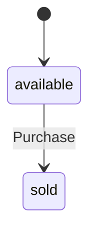
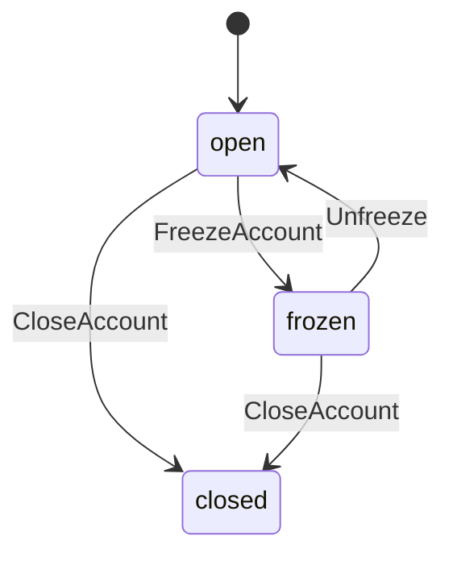

# hecks

hecks is an **executable domain specification language**. A
[`.bluebook`](#bluebook) file declares a business domain — its aggregates,
rules, and events — and that declaration *is* the running system, not a
spec that code is later written from:

```ruby skip
given("at most 10 toppings") { toppings.size < 10 }

sets :toppings, append: { name: :topping, amount: :amount }

emits "ToppingAdded"
```

`given` refuses a command before it runs; `sets` is the only way state
changes; `emits` is the only way anything downstream finds out. There
is no handler body behind those three lines — the runtime dispatches
directly from the declaration. A domain is data, so it can be read,
diffed, statically checked, run against generated fuzz sequences, and
compiled into another language, the same way any other data can.

The project uses its own words (bluebook, hecksagon, world, chapter, era and
others). You can skip them at first; the [Glossary](#glossary) defines each
one.

**Status:** Current release: `3.10.0`. See [Project status](#project-status)
for what the stability promise made at `1.0.0` covers and what it explicitly
doesn't yet.

## Install

```sh
gem install hecks
```

Or in a Gemfile: `gem "hecks"`.

The gem installs a `hecks` command for a domain you supply: `init`
(writes the stub of a new one), `interview` (drafts one from a conversation
with someone who knows the business), `run`, `docs`, `narrate`, `ir`, `stores`, `model_check`, `smoke_test`,
`project_diagrams`, `project_cli`, and `mcp` (the MCP door, over stdio
only). `hecks` lists them and `hecks <command> --help` prints one's
usage. In a clone of this repository, the same launcher also answers the
maintainer commands (`hecks publishing_run.publish`, `hecks regeneration_run.regenerate_corpus`,
`hecks conformance_run.measure_doc_coverage`, and the rest of the Codebase chapter).

The gem carries the pizzas example the quickstart uses, so once it is installed
`hecks console` opens it. A clone adds the rest of the repository: the guides, the
other examples and the sources.

## Quickstart

About ten minutes, and no database server. You need Ruby 3.2 or newer. If
installing fails building the `pg` gem, install Postgres's client library
(`libpq`) and run it again; nothing here connects to a database.

```sh
gem install hecks
hecks console
```

Or from a clone, which is how you work on hecks itself:

```sh
git clone https://github.com/heckslabs/hecks
cd hecks
bundle install
bundle exec hecks console
```

`console` boots the `examples/pizzas` domain on the in-memory adapter
and drops you into IRB with its [door](#door) installed. Nothing needs a
database, and `git status` stays clean. Type this at the prompt (`exit`
leaves it):

<!-- doctest:boot
Kernel.load(File.join(InMemoryDomain::ROOT, "examples/pizzas/bluebook/pizzas.bluebook"))
Hecks.hecksagon("Pizzas") do
  attaches "Governance"
  Pizzas::Order.persisted_by("Memory")
end
Hecks.hecksagon("Governance") do
  Governance::RoleAssignment.persisted_by("Memory")
  Governance::RoleTransition.persisted_by("Memory")
end
-->

```ruby
order = Order.create_pizza!(name: "Margherita", pizza: { price_cents: { cents: 1200 }, size: "large" })
order.purchase!(customer_name: "Chris", amount: { cents: 1200 })   # ~> GivenNotMet: a pizza needs at least one topping

order.add_topping!(topping: "Basil", amount: 3)
order.purchase!(customer_name: "Chris", amount: { cents: 1200 })

order.status             # => "sold"
order.events.last.name   # => "PizzaPurchased"
```

A value object with a single attribute takes a bare scalar (`name:
"Margherita"` wraps into its one field); one with several fields, like
`pizza:`, takes an object. The first `purchase!` is refused by a `given`
declared on the command, before anything changes.

That block runs on every push, claims and all — not an illustration.
So does every other `ruby`-fenced example in this README and in
[the guides](docs/implemented/guides/); `spec/guides_spec.rb` is the
harness.

Next, [Getting started](docs/implemented/guides/getting-started.md) walks
through the pizzas bluebook you just dispatched against, and
[Your own domain](docs/implemented/guides/your-own-domain.md) has you write
a bluebook of your own (starting from `hecks init`), run it, and deploy it
to AWS Lambda. The
[Glossary](#glossary) at the end of this page defines the project's own
words. `bundle exec hecks console subject=<domain>` boots any other domain
directory as that directory is wired.

## Why

Take one real rule — "a pizza may carry at most 10 toppings." In a
conventional application that rule tends to end up in several places at
once: a check in the request handler, maybe a mirror of it in a
client-side form, an ORM validation or a database constraint, a line in
a test fixture asserting the boundary. Each copy is correct on its own.
None of them is *the* rule — the rule is whatever the union of all four
happens to enforce on a given day, and it drifts the moment one of them
is touched without the others.

In hecks that rule is written once, on the command that can violate it:

```ruby skip
given("at most 10 toppings") { toppings.size < 10 }
```

There is exactly one place this can be checked, because there is
exactly one path a command can take to reach state — every dispatch
walks the same fixed order (refuse unknown/missing arguments, check
role, enforce every `given`, apply the mutation, enforce every
`ensures`, persist, emit), for every command, in every domain. A rule
that is checked once, in the one place a violation can occur, cannot
quietly stop being checked somewhere.

What this does not give you is a check that the rule is the right one. If the
business meant 12 toppings and the bluebook says 10, hecks enforces 10
identically in every runtime. Verification here shows the specification agrees
with itself and that the runtimes agree with each other; whether the
specification says what the business wants is still a human judgment.

Generalize that from one rule to a whole domain and the shape of the
bet becomes: **the business specification should be the durable
artifact, and the implementation running it should be the disposable
one.** A traditional stack reads roughly as

```
business requirement → developer/AI interpretation → application code → framework/runtime
```

— four lossy translations between the rule and the thing enforcing it,
each one a place the two can diverge. hecks collapses the middle two:

```
business domain → bluebook (explicit, constrained specification) → validated semantics → runtime/adapter
```

The specification is what a reviewer reads to know what the business
actually requires; it is also, unmodified, what runs. Swapping the
runtime underneath it — a different persistence adapter, a different
dispatch language entirely — does not touch the specification at all
(see [Projections](docs/implemented/guides/projections.md)).

This is not a hypothetical concern about hecks's own [corpus](#corpus). [ADR
0025](docs/decisions/0025-the-dsl-names-one-idea-one-way-and-a-word-earns-its-place-by-being-used.md)
in this repository's own decision log measured it directly: two
preconditions — "the customer is active" and "the customer is not
closed" — had been independently typed out, worded slightly
differently each time, across **44% of all 183 `given` clauses** in
the corpus, because nothing made the duplication visible until someone
counted. The fix wasn't a linter; it was a language feature
(`given("customer is active")`, declared once and referenced by name
elsewhere) that makes the *duplication itself* impossible to write by
accident.

### Why this gets sharper with AI-generated code

Generating code has become cheap. Reviewing an ever-growing,
arbitrary codebase for architectural drift, duplicated business rules,
and quietly-diverging invariants has not gotten any cheaper, and an AI
agent editing that codebase inherits the same problem a human
maintainer has: it has to hold thousands of implementation details in
mind to avoid breaking one while fixing another, and nothing stops it
from re-deriving "at most 10 toppings" a fifth way in a fifth file.

hecks's bet is narrower and more mechanical than "AI will manage
complexity for you": constrain what gets modified — by a human or an
agent — to a small, closed, checked vocabulary (`aggregate`, `command`,
`given`, `sets`, `emits`, and a couple dozen more), and let the
compiler and runtime carry the burden of architectural consistency that
would otherwise depend on whoever (or whatever) is editing the code
noticing it. A bluebook that violates an invariant refuses to boot or
refuses to dispatch, deterministically, regardless of whether a person
or a model wrote the line. See [AI-native
development](docs/implemented/guides/ai-native-development.md) for what
that looks like as a concrete integration today, not just an argument.

## How it works

A domain is three files, each with one job. `.bluebook` declares what
the domain *is* — aggregates, commands, rules — independent of how any
deployment runs it. `.hecksagon` wires it to real ports: which adapter
persists it, which framework it attaches to. [`.world`](#world) holds the one
thing neither of those names — per-deployment values, like a database
URL. [Wiring](docs/implemented/guides/wiring.md) covers the last two in
full; here is the first, in full — `examples/pizzas/bluebook/pizzas.bluebook`,
trimmed to fit:

```ruby skip
aggregate "Order" do
  identified_by :name

  attribute :name,     PizzaName
  attribute :toppings, list_of(Topping)

  value_object "PizzaName" do
    attribute :value, String
    invariant("a pizza is named") { !value.to_s.empty? }
  end

  value_object "Topping" do
    attribute :name,   String
    attribute :amount, Integer
  end

  lifecycle :status, default: "available" do
    transition "Purchase" => "sold", from: "available"
  end

  command "CreatePizza" do
    role "Chef"
    attribute :name,  PizzaName
    attribute :pizza, Pizza
    emits "PizzaCreated"
  end

  command "AddTopping" do
    role "Chef"
    reference_to Order
    attribute :topping, ToppingName
    attribute :amount, ToppingAmount

    given("a sold pizza cannot be changed") { status == "available" }
    given("at most 10 toppings")            { toppings.size < 10 }

    sets :toppings, append: { name: :topping, amount: :amount }
    emits "ToppingAdded"
  end
end
```

An aggregate is the thing with identity — two orders named
`"Margherita"` *are* the same order, which is exactly what
`identified_by :name` declares. A value object has none; a `PizzaName`
is only its value, and its invariant travels with the value everywhere
it goes. The lifecycle names the states an order may hold and the
transitions between them. A command says three things and no more:
what it needs, what it refuses (`given`), what it announces (`emits`).

Nothing here is hand-drawn either — the same declaration draws its own
diagrams:

<!-- generated:begin id=diagrams -->
`hecks project_diagrams` reads a booted domain's own declaration and draws it as Mermaid — nine kinds so far: `<Name>_lifecycle.mmd`, `relationships.mmd`, `dispatch.mmd`, `roles.mmd`, `ports.mmd`, `read_models.mmd`, `<Name>_surface.mmd` (what a command does, and what it writes), `<Name>_saga.mmd`, and `frameworks.mmd`. Nothing hand-drawn — the same reason a domain is data at all. Order's own lifecycle, straight off the bluebook above:


```mermaid
%% GENERATED by hecks project_diagrams from Order's own declared lifecycle (field: status) — DO NOT EDIT BY HAND.
%% Re-run `hecks project_diagrams <domain-path> Pizzas` after any change.
stateDiagram-v2
    [*] --> available
    available --> sold: Purchase
```

The full set for every domain in this checkout — `examples/pizzas`, `examples/banking` — lives in [`docs/generated/diagrams/`](docs/generated/diagrams/), held to the declaration by `spec/diagrams_spec.rb` the same drift-refusing way this page is held to its own source.
<!-- generated:end -->

The expression inside `given`/`ensures`/`invariant` is Ruby, parsed by
Prism and reduced to canonical text stored alongside the rest of the
IR — the same reason the domain as a whole is data rather than code —
and its grammar is small and closed for the same reason: an operator
is admitted only once it earns its place rendering a real rule already
in the corpus. Full grammar and dispatch order in [Running a
runtime](docs/implemented/guides/running-a-runtime.md).

## Example: a business workflow

Pizzas is deliberately small. This is `examples/banking` — trimmed
here to one aggregate, the untrimmed original is
`examples/banking/bluebook/`:

```ruby bluebook
Hecks.bluebook "Banking" do
  vision "Customers hold accounts, accounts move money, and every movement is a transfer that can fail halfway. The domain that has to get it right twice — once in the rules, once in the recovery."
  core

  aggregate "Account" do
    identified_by :number

    attribute :number,  AccountNumber
    attribute :balance, Money

    value_object "AccountNumber" do
      attribute :value, String
      invariant("an account number is present") { !value.to_s.empty? }
    end

    value_object "Money" do
      attribute :cents,    Integer, default: 0
      attribute :currency, String,  default: "USD"

      invariant("a currency is a three-letter code") { currency.to_s.size == 3 }
    end

    value_object "PositiveMoney" do
      attribute :cents,    Integer
      attribute :currency, String, default: "USD"

      invariant("an amount is positive") { cents.positive? }
      invariant("a currency is a three-letter code") { currency.to_s.size == 3 }
    end

    lifecycle :status, default: "open" do
      transition "FreezeAccount" => "frozen", from: "open"
    end

    command "Open" do
      role "Branch clerk"
      attribute :number, AccountNumber
      sets :number
      emits "AccountOpened"
    end

    command "Credit" do
      role "Teller"
      reference_to Account
      attribute :amount, PositiveMoney

      given("the account is open") { status == "open" }
      sets :balance, increment: :amount
      emits "AccountCredited"
    end
  end
end
```

```ruby boot
Hecks.hecksagon("Banking") do
  attaches "Governance"
  Banking::Account.persisted_by("Memory")
end
Hecks.hecksagon("Governance") do
  Governance::RoleAssignment.persisted_by("Memory")
  Governance::RoleTransition.persisted_by("Memory")
end
```

An aggregate, a lifecycle, an invariant, a command, an event — executed:

```ruby
account = Account.open!(number: "1001")
account.credit!(amount: { cents: 500, currency: "USD" })

account.balance.to_h                                       # => { cents: 500, currency: "USD" }
account.credit!(amount: { cents: -1, currency: "USD" })    # ~> InvariantViolation: an amount is positive
```

The real `Account` — the one in `examples/banking/bluebook/`, not the
trimmed one above — is where the "one rule, checked once" argument from
[Why](#why) stops being a toy example. Six different commands can move
its `balance`; "the balance never goes negative" used to be three
different `given`/`ensures` clauses, worded differently, with two
commands that could only *increase* the balance saying nothing at all
— correctness depended on someone noticing which commands could
decrease it. It is now one aggregate-level `invariant`, checked after
every one of those six commands, stated once:

```ruby skip
# examples/banking/bluebook/deposit_accounts.bluebook — the real Account
invariant("the balance never goes negative") { balance.cents >= 0 }

command "Debit", from: "open" do
  role "Teller"
  reference_to Account
  attribute :amount, PositiveMoney

  given("customer is active")
  given("the balance covers it")     { balance.cents >= amount.cents }
  given("the daily limit allows it") { daily_limit.cents >= amount.cents }

  sets :balance, decrement: :amount
  sets :ledger,  append: { amount: :amount, narrative: :narrative, direction: { value: "debit" } }

  # "no debit leaves the balance negative" — GONE, not reworded: the
  # aggregate's own invariant above says it now.
  ensures("the balance fell by exactly the amount") { old.balance.cents == balance.cents + amount.cents }

  emits "AccountDebited"
end
```

`Account`'s own lifecycle, drawn from that same real declaration —
another aggregate, another set of states, nothing hand-drawn here either:


```mermaid
%% GENERATED by hecks project_diagrams from Account's own declared lifecycle (field: status) — DO NOT EDIT BY HAND.
%% Re-run `hecks project_diagrams <domain-path> Banking` after any change.
stateDiagram-v2
    [*] --> open
    open --> frozen: FreezeAccount
    frozen --> open: Unfreeze
    open --> closed: CloseAccount
    frozen --> closed: CloseAccount
```

To drive the full domain by hand, `bundle exec hecks console subject=examples/banking` boots it
as wired. Banking is bound to [Heki](#heki), which keeps its records in
the git-tracked `examples/banking/data/`, so a dispatch there shows up in
`git status`; `git checkout -- examples/banking/data` and
`git clean -f examples/banking/data` put the clone back.

```ruby skip
customer = Customer.register!(reference: "CUST-1001", name: { given: "Chris", family: "Young" }, email: { address: "chris@example.com" })
account  = Account.open!(customer: "CUST-1001", number: "1001", kind: { name: "current" }, daily_limit: { cents: 50_000 })
account.credit!(amount: { cents: 500, currency: "USD" }, narrative: { text: "Opening deposit" })

account.balance.to_h    # => { cents: 500, currency: "USD" }
account.status          # => "open"
```

To run a scripted step list instead of a REPL, writing to the same files:

```sh
bundle exec hecks run examples/banking spec/corpus/banking.json
```

## Why this architecture matters

Only what this repository actually does today, checked, not aspired to:

- **Explicit semantics.** Every effect a command may cause is one of a
  closed set of declared verbs (`sets`, `increment`/`decrement`,
  `append`); every refusal is a named `given` or invariant. There is no
  code path that mutates state outside `sets`.
- **Static verification.** `hecks model_check` runs structural analysis
  over a domain's own IR — unreachable lifecycle states, transitions
  nothing can fire, saga states no handler chain reaches — before
  anything boots against real data.
- **Property-based fuzzing, including determinism.** `hecks fuzz_run.fuzz`
  generates random-but-valid command/query sequences from a domain's
  own IR and checks four properties: every lifecycle value a replay
  produces was declared, every saga advance follows a declared handler,
  query answers match a reference implementation, and — the one that
  actually matters for an event-sourced system — **replaying the same
  steps against a fresh boot produces byte-identical history.** This
  runs against the Memory adapter by default, can steer seeds by real
  runtime line coverage (`runtime_coverage_feedback`, off by default), and against real Sqlite
  and Postgres with `hecks fuzz_run.fuzz adapter=sqlite` (or `adapter=postgres`) (see
  [Project status](#project-status)).
- **A corpus that checks its own refusals.** `spec/corpus/*.json`
  scripts real command/query sequences — successes and refusals both —
  replayed by `hecks run` and pinned by `spec/corpus_spec.rb`; a runtime
  that *accepts* what the corpus says must be refused is the failure
  that matters more than one that rejects a valid command.
- **Event-oriented by construction.** `emits` is the only way anything
  outside a command's own aggregate learns what happened; every emitted
  event is durably recorded, not just returned to the caller.
- **Runtime and adapter separation.** `persisted_by` in a `.hecksagon`
  file is the entire migration between an in-memory adapter and a real
  database — the `.bluebook` file never names a backend, so it never
  changes. `Memory`, `SqlitePersistence`, `Postgres`, `PostgresEra` (adds
  schema-evolution tracking — see [Schema
  evolution](docs/implemented/guides/schema-evolution.md)), and `Heki`
  (an append-only journal, no server) all satisfy the same persistence
  port.

The same separation extends past persistence, to dispatch itself:
[Projections: Rust and WebAssembly](docs/implemented/guides/projections.md)
covers the generated Rust runtime, its WASM build, and how both are held
byte-for-byte to Ruby in CI. [AI-native
development](docs/implemented/guides/ai-native-development.md) covers the
[storehouse](#storehouse) bus and the MCP door a coding agent works
through.

## Project status

Current release: `3.10.0`. [`docs/1.0-readiness.md`](docs/1.0-readiness.md)
states plainly what the stability promise made at `1.0.0` covers — the DSL
and runtime API in [the DSL reference](docs/implemented/reference/index.md)
won't change in a breaking way without a major-version bump — and what it
explicitly doesn't cover yet. [Project
status](docs/implemented/guides/project-status.md) lists what works today,
exercised in CI on every push, and what is experimental or partial.

**Planned or research only — nothing below is built:**

- Rails integration (`docs/rails-integration.md` — design only).
- Inbound scheduling ("Drivers": interval/cron/clock triggers declared
  in the hecksagon).
- A standalone outbox relay process / shared adapter-host protocol
  (the transactional outbox itself shipped — see
  [Project status](docs/implemented/guides/project-status.md#experimental-or-partial)).

[Project status](docs/implemented/guides/project-status.md) is the current
list of what is experimental or partial.
[`docs/future-features.md`](docs/future-features.md) is a snapshot of what was
unbuilt on 2026-08-18; items may have shipped since, so check a capability
against the code before assuming it is missing or present.

## Documentation

<!-- generated:begin id=guides -->
- [Aggregates and value objects](docs/implemented/guides/aggregates-and-value-objects.md)
- [AI-native development](docs/implemented/guides/ai-native-development.md)
- [Behaviors](docs/implemented/guides/behaviors.md)
- [Commands](docs/implemented/guides/commands.md)
- [Entities](docs/implemented/guides/entities.md)
- [Extending Hecks](docs/implemented/guides/extending-hecks.md)
- [Getting started](docs/implemented/guides/getting-started.md)
- [Guides](docs/implemented/guides/index.md)
- [Language versioning](docs/implemented/guides/language-versioning.md)
- [Lifecycles](docs/implemented/guides/lifecycles.md)
- [Policies and process managers](docs/implemented/guides/policies-and-process-managers.md)
- [Project status](docs/implemented/guides/project-status.md)
- [Projections: Rust and WebAssembly](docs/implemented/guides/projections.md)
- [Queries and read models](docs/implemented/guides/queries-and-read-models.md)
- [Running a runtime](docs/implemented/guides/running-a-runtime.md)
- [Schema evolution](docs/implemented/guides/schema-evolution.md)
- [Verification](docs/implemented/guides/verification.md)
- [Wiring](docs/implemented/guides/wiring.md)
- [Writing an adapter](docs/implemented/guides/writing-an-adapter.md)
- [Your own domain](docs/implemented/guides/your-own-domain.md)
<!-- generated:end -->

<!-- generated:begin id=reference -->
[The DSL reference](docs/implemented/reference/index.md) — 23 contexts, generated from the aggregate-local tables under `lib/hecks/language/` and held to them by `spec/reference_golden_spec.rb`.
<!-- generated:end -->

The architecture map, the command table, the resolution rules, the decision
log, the changelog and the design documents are listed under [Beyond the
guides](docs/implemented/guides/index.md#beyond-the-guides).

The example domains this README draws from, plus one that consumes a
vendored [embryonaut bluebook](#embryonaut-bluebook):

<!-- generated:begin id=corpus -->
- **banking** — Customers hold accounts, accounts move money, and every movement is a transfer that can fail halfway. The domain that has to get it right twice — once in the rules, once in the recovery.
- **chess** — A chess game: pieces with no life outside the board that holds them, a status that only ever moves one legal way at a time, and turn order and check enforced by declaration rather than a hand-written engine.
- **compliance** — Something elsewhere already acted to contain a risk; this domain tracks the human review that decides what happens next.
- **directory** — A staff directory: members once addressed by the name they walked in with, now by the email that actually identifies them one person to one row.
- **embryonaut_vendoring_demo** — The smallest possible consumer of a vendored embryonaut bluebook: its own tiny aggregate (Gadget), attached beside a vendored package's own Widget (../vendor/embryonaut_bluebooks/widgets) through `attaches ... from: :vendor`, exercising the same dispatch-table merge a gem `attaches` already proves for Governance/Identity in examples/banking — see docs/decisions/0058 for what this domain exists to prove and what it deliberately does not.
- **pizzas** — Put toppings on a pizza and sell it to a customer.
- **roster** — A crew roster: seats added one at a time, members enlisted, each seated once — the smallest domain whose every rule is a question asked of a LIST.
<!-- generated:end -->

## Glossary

The project's own words, in the order a newcomer usually meets them.

### Bluebook

A `.bluebook` file: one domain's declaration — its aggregates, value
objects, commands, rules, events, queries and policies — written in the
hecks DSL (`Hecks.bluebook "Pizzas" do … end`). It never names a backend.

### Hecksagon

A `.hecksagon` file: the wiring for a bluebook — which adapter persists
each aggregate (`Pizzas::Order.persisted_by("Memory")`), which framework
chapters it attaches (`attaches "Governance"`), and its ports. See
[Wiring](docs/implemented/guides/wiring.md).

### World

A `.world` file: per-deployment values neither the bluebook nor the
hecksagon names, such as a database URL (`examples/pizzas/bluebook/pizzas.world`).

### Door

The Ruby surface a boot installs: one top-level module per booted
chapter and one per aggregate, so `Order.create_pizza!(…)` dispatches the
`CreatePizza` command. Each boot re-installs it. The MCP server
`hecks mcp` is a door of the same kind, for an agent over stdio.

### Chapter

One named `Hecks.bluebook` declaration and the module the door installs
for it (`Pizzas`). The language's framework chapters (`Governance`,
`Identity`, `Privacy` and others) live in `lib/hecks/framework/bluebook/`
and its grammar chapters in `lib/hecks/grammar/`; a hecksagon attaches a
framework chapter with `attaches`.

### Heki

A persistence adapter with no server: an append-only journal file per
aggregate (`data/*.heki`, `*.heki.journal`). `examples/banking` is bound
to it.

### PostgresEra

The Postgres persistence adapter that also tracks schema evolution. It
holds the source text each [era](#era) of a domain was born from, refuses
to boot on drift between that text and the booting text, and requires a
`translations/*.bluebook` file before a shape change reinterprets old
rows. It is a plugin loaded with
`require "hecks/ports/persistence/plugins/era"`, and it needs a reachable
Postgres. See [Schema evolution](docs/implemented/guides/schema-evolution.md).

### Era

One version of a domain's shape as `PostgresEra` holds it, numbered in
order. A declared translation carries existing records from one era to
the next.

### Corpus

Every real domain in this repository that the tooling walks: the example
domains under `examples/`, the framework and grammar chapters, and the
other domain directories `lib/hecks/corpus.rb` names. `spec/corpus/*.json`
holds the scripted command and query sequences replayed against them.

### Storehouse

`Hecks::Storehouse` (`lib/hecks/storehouse.rb`): one bus that dispatches,
queries and inspects every booted domain, requiring a `summary` on every
call and a caller role on a role-gated command. `hecks mcp`
serves it over MCP. See [AI-native
development](docs/implemented/guides/ai-native-development.md).

### Embryonaut bluebook

A bluebook package vendored into a consuming domain's own
`vendor/embryonaut_bluebooks/<name>/` directory and attached from its
hecksagon with `attaches "<name>", from: :vendor`, the same way
`attaches` attaches a framework chapter.
`examples/embryonaut_vendoring_demo` is the worked example.

## Contributing

Issues, examples, and runtime/adapter work are all welcome — the gaps
in [Project status](docs/implemented/guides/project-status.md) are real
starting points, not a formality.
Before sending a change: `bundle exec rspec`, `hecks model_check`, and
`hecks fuzz_run.fuzz` are what CI runs, and every `ruby`-fenced example in a guide
or this README is expected to execute exactly as shown
(`spec/guides_spec.rb`). See [`CONTRIBUTING.md`](CONTRIBUTING.md) for
the full checklist. To check the whole claim, not just the demo:

```sh
bundle exec rspec       # the whole suite
bundle exec hecks model_check   # static analysis over a domain's IR
bundle exec hecks fuzz_run.fuzz          # generated sequences, checked against declared properties
```

## License

Apache License 2.0 — see [`LICENSE`](LICENSE).
