# Banking — Glossary

> Customers hold accounts, accounts move money, and every movement is a transfer that can fail halfway. The domain that has to get it right twice — once in the rules, once in the recovery.

Every term Banking uses, in the words of the people who work in it — grouped under the thing each belongs to, and listed A to Z within it. This page is generated from the working specification, so it says what the system does today, not what anyone hoped it would do. If a sentence here reads wrong to you, the specification is wrong: say so.

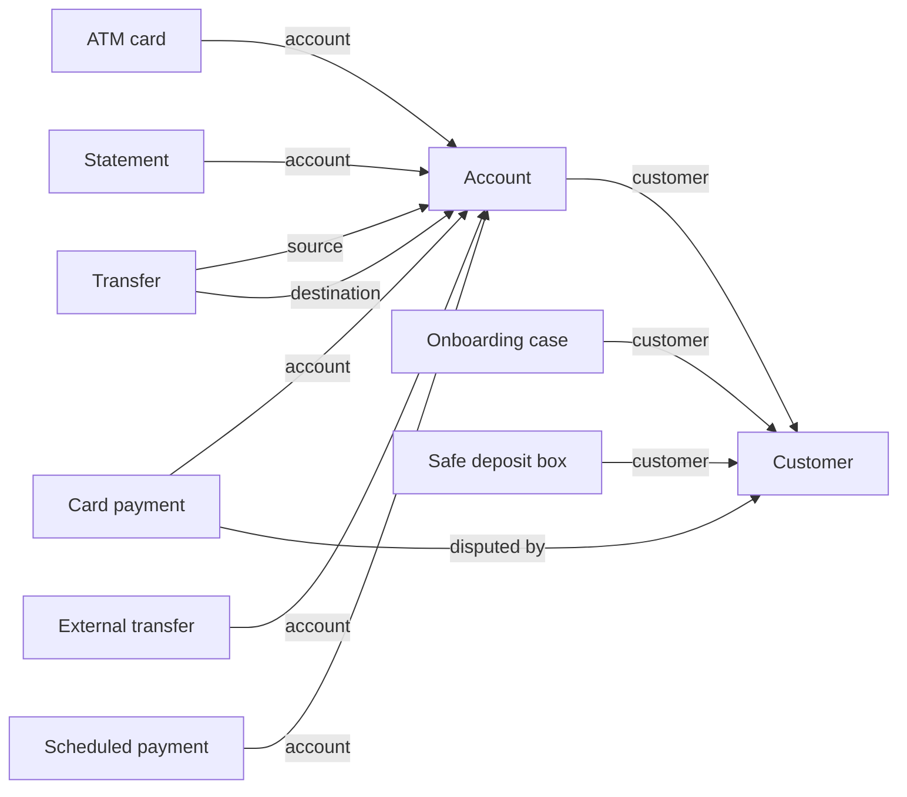

## Account

> A balance belonging to one customer, and the ledger that explains how it got there.

Starts out open. Can be open, frozen, or closed.

**How it fits**

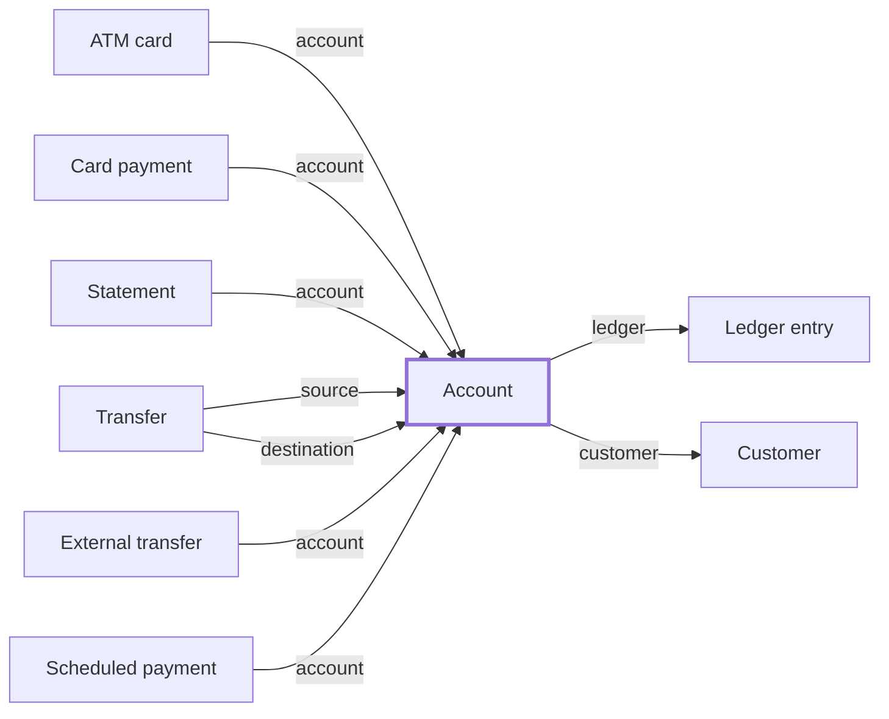

**How it moves**

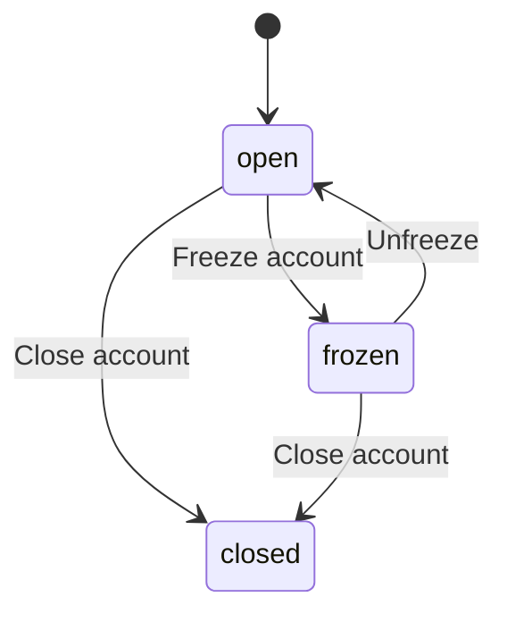

**Always true**

- An Account references a Customer.
- An Account has many ledger.
- The balance never goes negative.
- An account number is present.
- A daily limit is non-negative.
- A ledger sequence is positive.
- A currency is a three-letter code.
- An amount is positive.
- A movement explains itself.

### Account closed

Recorded after [Close account](#close-account). Prompts [Notify on closure](#notify-on-closure).

### Account credited

Recorded after [Credit](#credit).

### Account debited

Recorded after [Debit](#debit).

### Account frozen

Recorded after [Freeze account](#freeze-account). Prompts [Review on freeze](#review-on-freeze).

### Account kind

One of current, savings, or reserve.

### Account number

Text.

Always true: an account number is present.

### Account opened

Recorded after [Open](#open).

### Account unfrozen

Recorded after [Unfreeze](#unfreeze).

### Accrue interest

Credit the account with interest earned. Done by the system.

### Amend

Correct a movement posted for the wrong amount. Done by the back office.

### Apply fee

Charge the account a fee. Done by the system.

### At most

Accounts holding no more than a cap the caller supplies — the small-balance closure candidates.

### Close account

Close an account that has been emptied. Done by the branch clerk.

### Correct fee

Reverse a fee that was applied in error. Done by the back office.

### Correct interest

Reverse interest that was accrued in error. Done by the back office.

### Credit

Put money in. Done by the teller.

### Daily limit

Made up of cents (a whole number).

Always true: a daily limit is non-negative.

### Debit

Take money out, if it is there to take. Done by the teller.

### Fee applied

Recorded after [Apply fee](#apply-fee).

### Fee corrected

Recorded after [Correct fee](#correct-fee).

### Freeze account

Stop an account moving while something is investigated. Done by the compliance officer.

### High balance

Accounts holding at least a floor the caller supplies — the private-banking referral list.

### Interest accrued

Recorded after [Accrue interest](#accrue-interest).

### Interest corrected

Recorded after [Correct interest](#correct-interest).

### Ledger direction

One of credit or debit.

### Ledger entry

One movement across the account, in the order it was posted.

Starts out posted. Can be posted or reversed.

### Ledger entry amended

Recorded after [Amend](#amend).

### Ledger entry reversed

Recorded after [Reverse](#reverse).

### Ledger sequence

A whole number.

Always true: a ledger sequence is positive.

### Money

Made up of cents (a whole number) and currency (text).

Always true: a currency is a three-letter code.

### Narrative

Made up of text (text).

Always true: a movement explains itself.

### Notify on closure

When [Account closed](#account-closed) happens, Notifications is asked to send, in Notifications.

### Open

Give a customer somewhere to keep money. Done by the branch clerk.

### Open (the list)

Accounts that can transact today.

### Open for customer

One customer's own open accounts — the for_each target that freezes every one of them on suspension, not just whichever the event payload happened to carry.

### Open for suspended customers

Open accounts whose customer has since been suspended — live money movement nobody should be approving right now.

### Overdrawn

Accounts below a floor the caller supplies — the morning risk report.

### Positive money

Made up of cents (a whole number) and currency (text).

Always true: an amount is positive; a currency is a three-letter code.

### Reachable

Accounts that still exist as far as a caller is concerned — anything short of closed.

### Reverse

Undo a movement that should not have been posted. Done by the back office.

### Reversed

Entries that were undone — the audit trail nobody wants to need.

### Review on freeze

When [Account frozen](#account-frozen) happens, Account freeze review is asked to open, in Compliance.

### Strictly above

Accounts holding MORE than a floor the caller supplies — the referral list without the accounts sitting exactly on the line.

### Unfreeze

Release a cleared account. Done by the compliance officer.

## ATM card

> A card issued against an account, and the cash taken with it.

Starts out issued. Can be issued, active, or retired.

**How it fits**

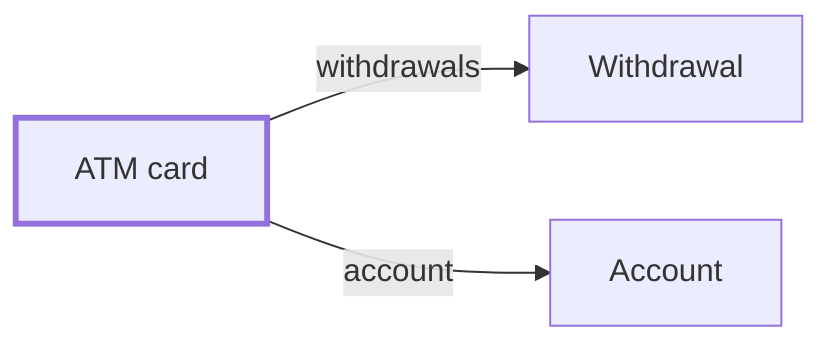

**How it moves**

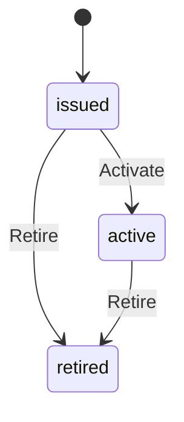

**Always true**

- An ATM card references an Account.
- An ATM card has many withdrawals.
- A card serial is present.
- A daily fee is non-negative.
- A withdrawal sequence is positive.
- A withdrawal amount is positive.
- A withdrawal explains itself.

### Activate

Start using a card. Done by the customer.

### Active

Live cards in nickname order, unnamed ones last — real nicknames sort among themselves first.

### ATM card activated

Recorded after [Activate](#activate).

### ATM card issued

Recorded after [Issue](#issue).

### ATM card renamed

Recorded after [Rename](#rename).

### ATM card retired

Recorded after [Retire](#retire).

### By fee

Live cards by what they cost to hold, cheapest first — a fee is a Float, so the order is numeric and not alphabetical.

### Card nickname

Text.

### Card serial

Text.

Always true: a card serial is present.

### Cash withdrawn

Recorded after [Withdraw](#withdraw).

### Daily fee

Made up of amount (a number).

Always true: a daily fee is non-negative.

### Dispute

Challenge a withdrawal that was not mine. Done by the customer.

### Issue

Put a card in a customer's hand. Done by the branch clerk.

### Narrative

Made up of text (text).

Always true: a withdrawal explains itself.

### Recent

The first two withdrawals still standing, whatever else was taken.

### Rename

Name a card so it is recognisable. Done by the customer.

### Retire

Take a card out of service. Done by the back office.

### Withdraw

Take cash out at a machine. Done by the customer.

### Withdrawal

One handful of cash, in the order it was taken.

Starts out taken. Can be taken or disputed.

### Withdrawal amount

Made up of cents (a whole number).

Always true: a withdrawal amount is positive.

### Withdrawal disputed

Recorded after [Dispute](#dispute).

### Withdrawal sequence

A whole number.

Always true: a withdrawal sequence is positive.

## Card payment

> A card authorisation that either settles, is voided before settlement, or becomes a post-settlement dispute.

Starts out authorized. Can be authorized, captured, voided, refunded, reversed, disputed, or charged back.

**How it fits**

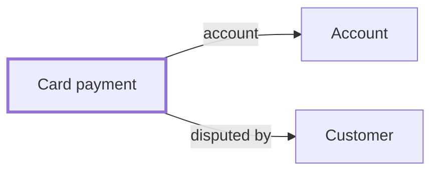

**How it moves**

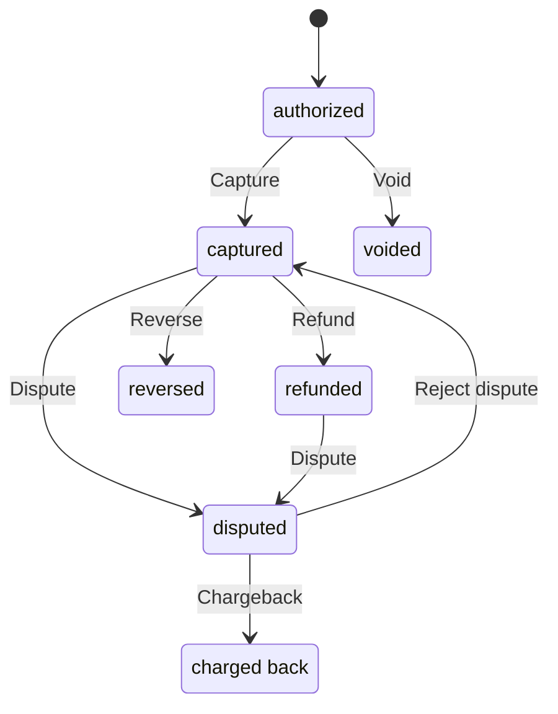

**Always true**

- A Card payment references an Account.
- A Card payment references a Customer.
- A Card payment has many tags.
- A payment amount is positive.
- A merchant name is present.
- A tag is not the empty string.

### Authorisation code

Text.

### Authorize

Put a hold on funds for a purchase.

### Capture

Turn an authorization into an actual charge. Done by the system.

### Card authorized

Recorded after [Authorize](#authorize).

### Card captured

Recorded after [Capture](#capture).

### Card charged back

Recorded after [Chargeback](#chargeback).

### Card dispute rejected

Recorded after [Reject dispute](#reject-dispute).

### Card disputed

Recorded after [Dispute](#dispute-1).

### Card refunded

Recorded after [Refund](#refund).

### Card reversed

Recorded after [Reverse](#reverse-1).

### Card voided

Recorded after [Void](#void).

### Chargeback

Uphold a customer's dispute and claw the charge back. Done by the compliance officer.

### Dispute

Challenge a payment that already settled. Done by the customer.

### Disputed

Charges currently under a customer's dispute, awaiting a compliance decision.

### Flagged

Charges carrying a risk tag, for the fraud queue.

### Merchant name

Text.

Always true: a merchant name is present.

### Payment amount

Made up of cents (a whole number).

Always true: a payment amount is positive.

### Pending

Authorized charges not yet captured, voided, or otherwise resolved.

### Refund

Give the money back after a charge settled. Done by the system.

### Reject dispute

Uphold the charge and close a customer's dispute. Done by the compliance officer.

### Reverse

Undo a captured charge with no customer dispute involved. Done by the system.

### Tag

Text.

Always true: a tag is not the empty string.

### Void

Cancel an authorization before it settles. Done by the system.

## Customer

> A person the bank holds a relationship with. Suspended rather than deleted — a bank forgets nothing.

Starts out active. Can be active, suspended, or closed.

**How it fits**

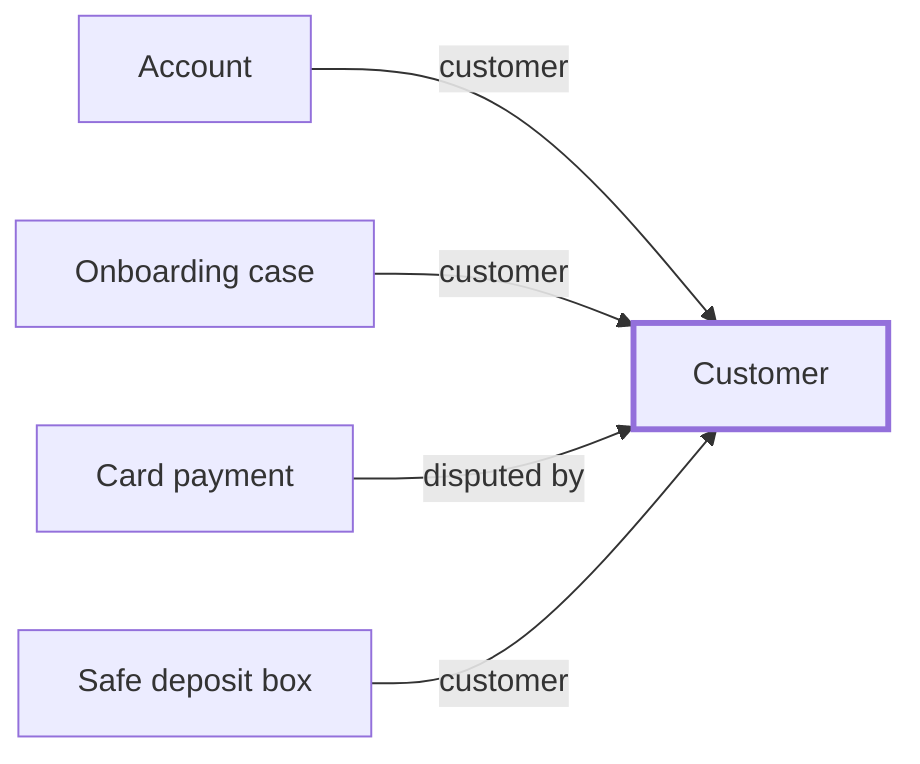

**How it moves**

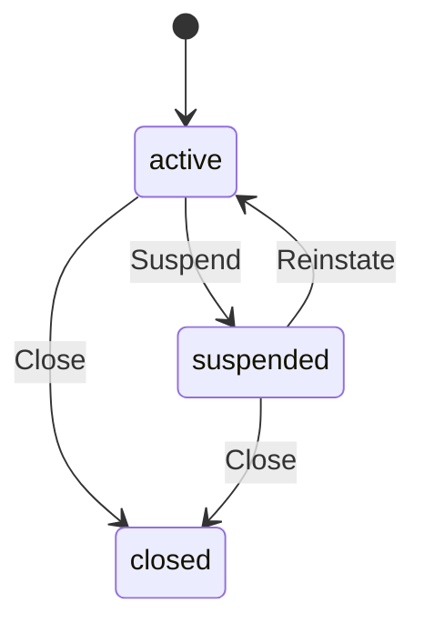

**Always true**

- A customer reference is present.
- A standing is named.
- A given name is present.
- A family name is present.

### Close

End the relationship. Done by the branch clerk.

### Customer closed

Recorded after [Close](#close).

### Customer number

Text.

Always true: a customer reference is present.

### Customer registered

Recorded after [Register](#register).

### Customer reinstated

Recorded after [Reinstate](#reinstate).

### Customer standing

Text.

Always true: a standing is named.

### Customer suspended

Recorded after [Suspend](#suspend). Prompts [Freeze accounts on suspension](#freeze-accounts-on-suspension).

### Email address

Made up of address (text).

### Freeze accounts on suspension

When [Customer suspended](#customer-suspended) happens, [Account](#account) is asked to [Freeze account](#freeze-account), once for each row of [Open for customer](#open-for-customer).

### In good standing

The everyday customer roll — active, and nothing outstanding against them.

### Not good standing

Everyone who is not in the everyday roll — suspended, under review, or anything else that is not simply "good".

### Person name

Made up of given (text) and family (text).

Always true: a given name is present; a family name is present.

### Register

Take on a new customer. Done by the branch clerk.

### Reinstate

Let a cleared customer transact again. Done by the compliance officer.

### Suspend

Stop a customer transacting while something is investigated. Done by the compliance officer.

### Suspended

The compliance queue, newest concern first.

## External transfer

> A transfer sent beyond the bank, where a recall is an instruction and a return is the external network's outcome.

Starts out requested. Can be requested, sent, recalled, or returned.

**How it fits**

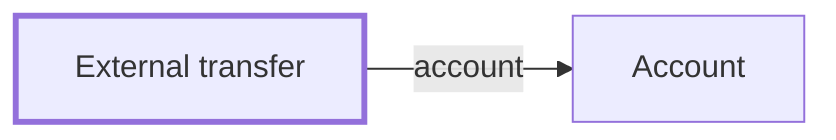

**How it moves**

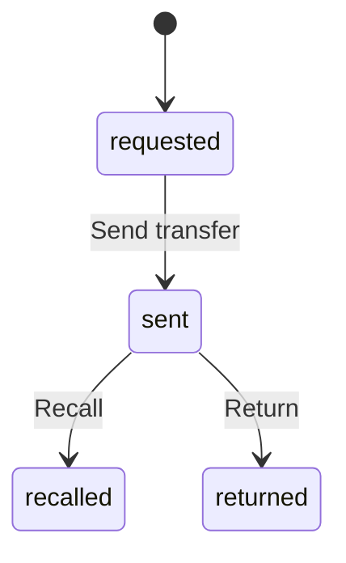

**Always true**

- An External transfer references an Account.
- An external transfer amount is positive.
- A beneficiary name is present.

### Beneficiary name

Text.

Always true: a beneficiary name is present.

### End to end reference

Text.

### External amount

Made up of cents (a whole number).

Always true: an external transfer amount is positive.

### External settlement

Begins when [External transfer requested](#external-transfer-requested) happens and ends when [External transfer sent](#external-transfer-sent) happens. Along the way it can be requested or returned.

### External transfer recalled

Recorded after [Recall](#recall).

### External transfer requested

Recorded after [Request](#request).

### External transfer returned

Recorded after [Return](#return).

### External transfer sent

Recorded after [Send transfer](#send-transfer).

### Movement direction

Text.

### Recall

Ask the external network to stop a transfer already sent. Done by the customer.

### Request

Send money to an account outside the bank. Done by the customer.

### Return

Record that the external network sent the money back. Done by the system.

### Send transfer

Release the transfer to the external network. Done by the system.

### Sent

Transfers already released to the external network, awaiting its outcome.

## Onboarding case

> The KYC check a newly registered customer clears before an account exists for them — screened once, and if it does not clear there is nothing to undo, because nothing was ever opened.

Starts out screening. Can be screening, cleared, or declined.

**How it fits**

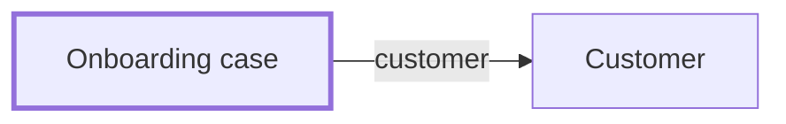

**How it moves**

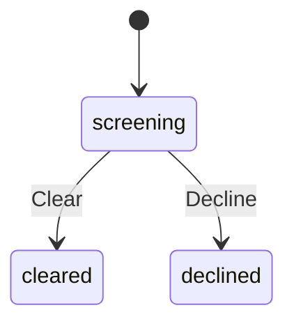

**Always true**

- An Onboarding case references a Customer.
- An onboarding case is referenced.
- An account number is present.

### Account number

Text.

Always true: an account number is present.

### Clear

Pass a customer's identity and screening checks. Done by the compliance officer.

### Decline

Refuse a customer who does not clear screening — no account was ever opened, so nothing is undone. Done by the compliance officer.

### Onboarding

Begins when [Onboarding opened](#onboarding-opened) happens and ends when [Account opened](#account-opened) happens. Along the way it can be screening, cleared, or declined.

### Onboarding cleared

Recorded after [Clear](#clear).

### Onboarding declined

Recorded after [Decline](#decline).

### Onboarding opened

Recorded after [Open](#open-1).

### Onboarding reference

Text.

Always true: an onboarding case is referenced.

### Open

Open a KYC case for a newly registered customer, naming the account it will become. Done by the branch clerk.

### Screening

Cases still waiting on a compliance decision.

## Safe deposit box

> A steel box in the vault, held under one customer's name and opened only against the branch and number stamped on its face.

Starts out vacant. Can be vacant or rented.

**How it fits**

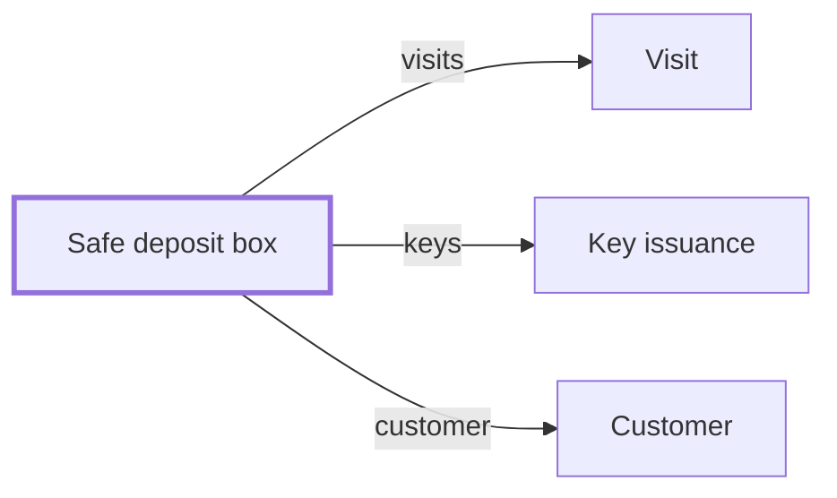

**How it moves**

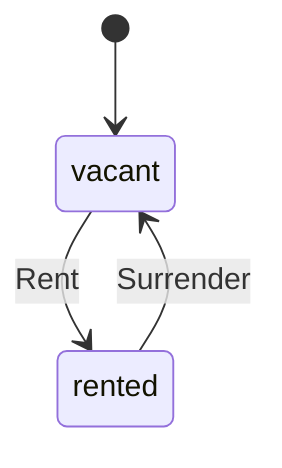

**Always true**

- A Safe deposit box belongs to a Customer.
- A Safe deposit box has many visits.
- A Safe deposit box has many keys.
- A branch is coded.
- A box is numbered from one.
- A visit sequence is positive.
- A visit names its date.
- A key is serialed.
- A written note is not blank.

### Annotate

Note something unusual about a visit after the fact. Done by the vault officer.

### Box number

A whole number.

Always true: a box is numbered from one.

### Box opened

Recorded after [Log visit](#log-visit).

### Box rented

Recorded after [Rent](#rent).

### Box surrendered

Recorded after [Surrender](#surrender). Prompts [Review on box surrender](#review-on-box-surrender).

### Branch code

Text.

Always true: a branch is coded.

### Flag key return

When [Key return due](#key-return-due) happens, Notifications is asked to send, in Notifications.

### Issue key

Cut a key for the box. Done by the vault officer.

### Key issuance

One key cut for the box, held by whoever last signed for it.

Starts out issued. Can be issued or returned.

### Key issued

Recorded after [Issue key](#issue-key).

### Key return due

Recorded after [Surrender](#surrender). Prompts [Flag key return](#flag-key-return).

### Key returned

Recorded after [Return](#return-1).

### Key serial

Text.

Always true: a key is serialed.

### Log visit

Record that the box was opened. Done by the vault officer.

### Recent

The last few visits, whatever the box has seen.

### Rent

Assign the box to a customer. Done by the branch clerk.

### Rented

Boxes currently assigned to a customer, for the annual access audit.

### Return

Take a key back when a holder is done with it. Done by the vault officer.

### Review on box surrender

When [Box surrendered](#box-surrendered) happens, Box surrender review is asked to open, in Compliance.

### Size

One of small, medium, or large.

### Surrender

Give the box back and take the keys off the account. Done by the customer.

### Visit

One opening of the box, in the order it happened that day.

Starts out logged. Can be logged.

### Visit annotated

Recorded after [Annotate](#annotate).

### Visit date

Text.

Always true: a visit names its date.

### Visit note

Made up of text (text).

### Visit sequence

A whole number.

Always true: a visit sequence is positive.

## Scheduled payment

> An instruction held for a future date, which may execute once or be cancelled before it does.

Starts out scheduled. Can be scheduled, executed, cancelled, failed, or abandoned.

**How it fits**

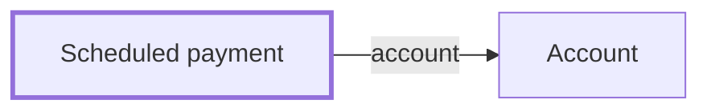

**How it moves**

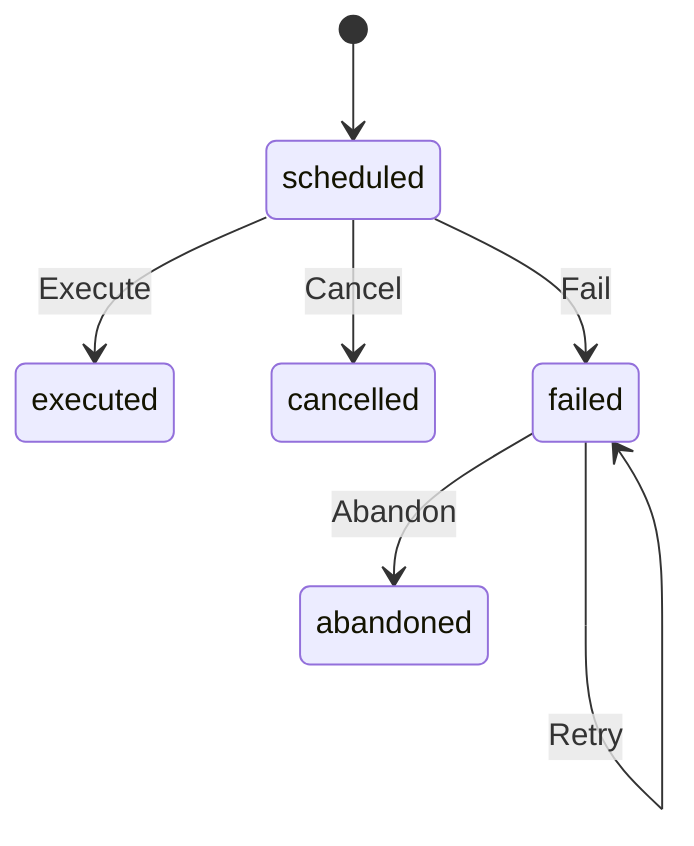

**Always true**

- A Scheduled payment references an Account.
- A scheduled payment amount is positive.
- A payment recipient is present.
- A payment due date is present.
- A retry count is non-negative.
- A retry limit is positive.

### Abandon

Give up on a payment that could not be collected after every retry. Done by the back office.

### Cancel

Call off a payment before its due date. Done by the customer.

### Due

Payments still scheduled, ordered by when they're due.

### Execute

Collect a payment on its due date. Done by the system.

### Fail

Record that today's presentment could not be collected. Done by the system.

### Instruction reference

Text.

### Payment due date

Text.

Always true: a payment due date is present.

### Payment recipient

Text.

Always true: a payment recipient is present.

### Payment scheduled

Recorded after [Schedule](#schedule).

### Retry

Re-present a failed payment, up to the limit the schedule names. Done by the system.

### Retry count

A whole number.

Always true: a retry count is non-negative.

### Retry limit

A whole number.

Always true: a retry limit is positive.

### Retry on payment failure

When [Scheduled payment failed](#scheduled-payment-failed) happens, [Scheduled payment](#scheduled-payment) is asked to [Retry](#retry).

### Schedule

Set up a payment to collect on a future date. Done by the customer.

### Scheduled amount

Made up of cents (a whole number).

Always true: a scheduled payment amount is positive.

### Scheduled payment abandoned

Recorded after [Abandon](#abandon).

### Scheduled payment cancelled

Recorded after [Cancel](#cancel).

### Scheduled payment executed

Recorded after [Execute](#execute).

### Scheduled payment failed

Recorded after [Fail](#fail) or [Retry](#retry). Prompts [Retry on payment failure](#retry-on-payment-failure).

## Statement

> A snapshot of one account's activity over one period, generated once and never revised.

**How it fits**

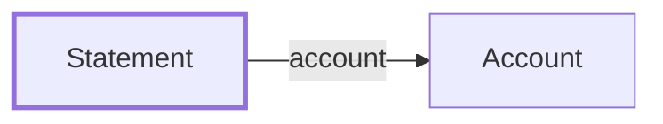

**Always true**

- A Statement references an Account.
- A statement names its period.
- A statement is dated.

### Generate

Close out one period's activity into a permanent record. Done by the system.

### Statement amount

Made up of cents (a whole number).

### Statement date

Text.

Always true: a statement is dated.

### Statement frequency

One of: monthly (retention months 84, paper fee cents 0); quarterly (retention months 120, paper fee cents 0); annual (retention months 240, paper fee cents 500).

### Statement generated

Recorded after [Generate](#generate).

### Statement period

Text.

Always true: a statement names its period.

## Transfer

> Money leaving one account for another. Two movements that must both happen, or neither.

Starts out requested. Can be requested, debited, credited, settled, reversed, or rejected.

**How it fits**

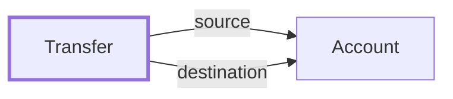

**How it moves**

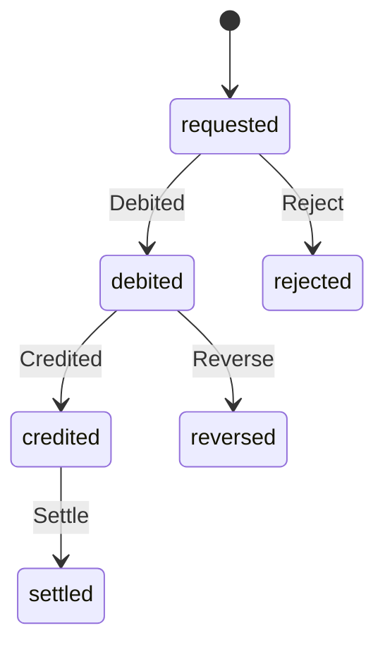

**Always true**

- A Transfer references an Account.
- A transfer is referenced.
- A transfer amount is positive.
- A transfer explains itself.

### Credited

Record that the destination credit committed. Done by the system.

### Debited

Record that the source account has given up the money. Done by the system.

### In flight

Transfers that have left one account and not arrived at the other. The list that must always empty.

### Narrative

Made up of text (text).

Always true: a transfer explains itself.

### Reject

Refuse a transfer before any money moved. Done by the system.

### Request

Send money to another account. Done by the customer.

### Reverse

Put the money back when the credit could not be made. Done by the system.

### Settle

Record that the destination has received it. Done by the system.

### Settlement

Begins when [Transfer requested](#transfer-requested) happens and ends when [Transfer settled](#transfer-settled) happens. Along the way it can be requested, awaiting credit, settled, or reversed.

### Transfer credited

Recorded after [Credited](#credited).

### Transfer debited

Recorded after [Debited](#debited).

### Transfer money

Made up of cents (a whole number).

Always true: a transfer amount is positive.

### Transfer reference

Text.

Always true: a transfer is referenced.

### Transfer rejected

Recorded after [Reject](#reject).

### Transfer requested

Recorded after [Request](#request-1).

### Transfer reversed

Recorded after [Reverse](#reverse-2).

### Transfer settled

Recorded after [Settle](#settle).

## Roles

> Who does what. A role is named once here rather than under every term it touches.

### Back office

Responsible for [Correct fee](#correct-fee), [Correct interest](#correct-interest), [Amend](#amend), [Reverse](#reverse), [Retire](#retire), and [Abandon](#abandon).

### Branch clerk

Responsible for [Register](#register), [Close](#close), [Open (account)](#open), [Close account](#close-account), [Open (onboarding case)](#open-1), [Issue](#issue), and [Rent](#rent).

### Compliance officer

Responsible for [Suspend](#suspend), [Reinstate](#reinstate), [Freeze account](#freeze-account), [Unfreeze](#unfreeze), [Clear](#clear), [Decline](#decline), [Chargeback](#chargeback), and [Reject dispute](#reject-dispute).

### Customer

Responsible for [Rename](#rename), [Withdraw](#withdraw), [Activate](#activate), [Dispute (withdrawal)](#dispute), [Dispute (card payment)](#dispute-1), [Surrender](#surrender), [Request (transfer)](#request-1), [Request (external transfer)](#request), [Recall](#recall), [Schedule](#schedule), and [Cancel](#cancel).

### System

Responsible for [Apply fee](#apply-fee), [Accrue interest](#accrue-interest), [Capture](#capture), [Void](#void), [Refund](#refund), [Reverse (card payment)](#reverse-1), [Generate](#generate), [Debited](#debited), [Settle](#settle), [Credited](#credited), [Reverse (transfer)](#reverse-2), [Reject](#reject), [Send transfer](#send-transfer), [Return](#return), [Execute](#execute), [Fail](#fail), and [Retry](#retry).

### Teller

Responsible for [Credit](#credit) and [Debit](#debit).

### Vault officer

Responsible for [Log visit](#log-visit), [Issue key](#issue-key), [Annotate](#annotate), and [Return](#return-1).

## Read models

> Questions answered across more than one of the things above.

### Accounts by kind

Every account the bank holds, sorted into what kind it is, then by its own number.

### Compliance dashboard

One account, its own status, and any card charges disputed against it — the working set for a compliance review.

### Customer portfolio

A customer's cross-account position, rebuilt from aggregate heads.

### Disputed payment count

How many of an account's own card charges are under dispute — a single number, not the rows themselves.

### Disputed payment median

The median amount of an account's own disputed card charges.
