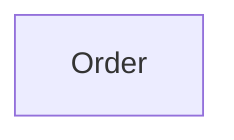
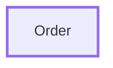
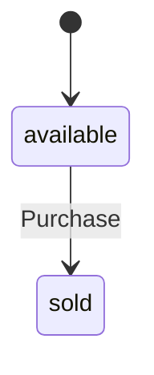

# Pizzas — Glossary

> Put toppings on a pizza and sell it to a customer.

Every term Pizzas uses, in the words of the people who work in it — grouped under the thing each belongs to, and listed A to Z within it. This page is generated from the working specification, so it says what the system does today, not what anyone hoped it would do. If a sentence here reads wrong to you, the specification is wrong: say so.

## Order

> An order that gathers toppings on a pizza and is eventually sold to a customer.

Starts out available. Can be available or sold.

**How it fits**

**How it moves**

**Always true**

- An Order has many toppings.
- A pizza is named.
- A price is never negative.
- A customer is named.
- A topping is named.
- An amount is positive.

### Add topping

Customize a pizza with an ingredient. Done by the chef.

### Available

### Costing less than

### Create pizza

Put a new pizza on the menu. Done by the chef.

### Customer name

Text.

Always true: a customer is named.

### Expensive

### Pizza

Made up of price cents ([Price](#price)) and size ([Size](#size)).

### Pizza created

Recorded after [Create pizza](#create-pizza).

### Pizza name

Text.

Always true: a pizza is named.

### Pizza purchased

Recorded after [Purchase](#purchase).

### Price

Made up of cents (a whole number).

Always true: a price is never negative.

### Purchase

Buy the pizza. Done by the customer.

### Size

One of small or large.

### Topping

Made up of name (text) and amount (a whole number).

### Topping added

Recorded after [Add topping](#add-topping).

### Topping amount

A whole number.

Always true: an amount is positive.

### Topping name

Text.

Always true: a topping is named.

## Roles

> Who does what. A role is named once here rather than under every term it touches.

### Chef

Responsible for [Create pizza](#create-pizza) and [Add topping](#add-topping).

### Customer

Responsible for [Purchase](#purchase).

## Reactions

> What happens on its own, in response to something this specification does not itself raise.

### On pizza payment received

When Pizza payment received happens, [Order](#order) is asked to [Purchase](#purchase).
