# QualityControl — Glossary

> A user should never be made to feel stupid by something that took what they said and quietly did otherwise. Every check writes down what it expected before it looks, every bug carries the test that proves it, and nothing reaches the outside world that nobody first tried to fix.

Every term QualityControl uses, in the words of the people who work in it — grouped under the thing each belongs to, and listed A to Z within it. This page is generated from the working specification, so it says what the system does today, not what anyone hoped it would do. If a sentence here reads wrong to you, the specification is wrong: say so.

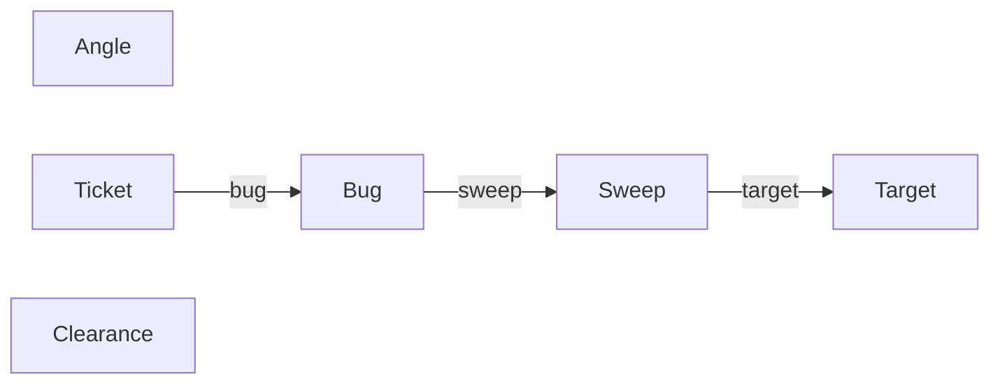

## Angle

> One concrete, citable reason to suspect an uninvestigated corner exists — proposed, chased down, and either built into something real or set aside with a reason. The practice's own backlog of what to try next, so a future sweep mines its own history instead of guessing.

Starts out proposed. Can be proposed, investigating, built, or discarded.

**How it fits**

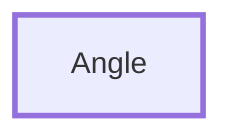

**How it moves**

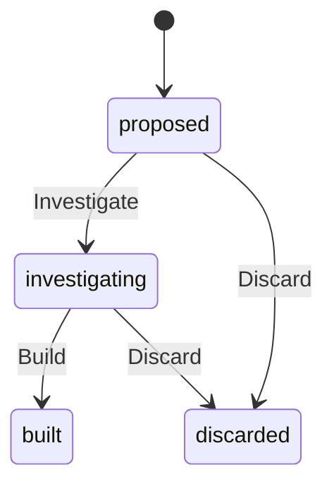

**Always true**

- An angle is referenced.
- An angle says enough to be acted on without its proposer in the room, in at least 60 characters.
- An angle cites something concrete, not a mood.
- An angle is proposed by somebody.
- An instant is not before the epoch.
- A built angle says what actually got built.
- Discarding an angle says why.

### All

Every angle ever proposed — what a runner mints the next reference from.

### Angle built

Recorded after [Build](#build).

### Angle citation

Text.

Always true: an angle cites something concrete, not a mood.

### Angle discarded

Recorded after [Discard](#discard).

### Angle investigated

Recorded after [Investigate](#investigate).

### Angle premise

Text.

Always true: an angle says enough to be acted on without its proposer in the room, in at least 60 characters.

### Angle proposed

Recorded after [Propose](#propose).

### Angle reason

Text.

Always true: discarding an angle says why.

### Angle reference

Text.

Always true: an angle is referenced.

### Angle resolution

Text.

Always true: a built angle says what actually got built.

### Backlog

Leads nobody has finished chasing yet, oldest first — read this before inventing a new angle from scratch.

### Build

Say what actually came of chasing this lead. Done by the qa engineer.

### Discard

Decide a lead is not worth the practice's time, and say why. Done by the qa engineer.

### Instant

A whole number.

Always true: an instant is not before the epoch.

### Investigate

Pick a lead up for a real look, rather than leaving it to look picked-up by default. Done by the qa engineer.

### Propose

Write down a concrete, citable reason to suspect an uninvestigated corner exists, before it is lost to a conversation. Done by the qa engineer.

### Proposer

Text.

Always true: an angle is proposed by somebody.

### Resolved

Leads already acted on, one way or the other — built into something real, or discarded with a reason. Read beside Backlog for the practice's own hit rate.

## Bug

> One thing now known to be wrong, the test that proves it, and how far the fix got.

Starts out logged. Can be logged, investigating, fixed, verified, paused, or withdrawn.

**How it fits**

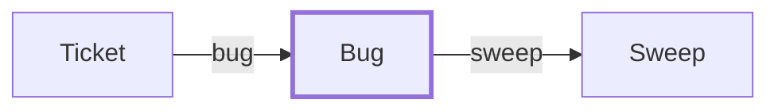

**How it moves**

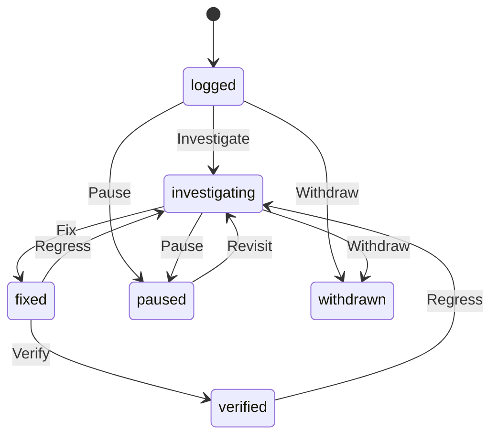

**Always true**

- A Bug references a Sweep.
- A Bug has many tags.
- A bug is referenced.
- A bug sequence is positive.
- A bug is titled.
- A bug is proven by a test somebody can re-run.
- A bug says what actually happened.
- A bug says what should have happened.
- An investigation names where the bug lives.
- An investigation says why the code is wrong.
- A verification says what was actually run.
- Stopping on a bug says why.
- Stopping on a bug says what would move it.
- A waiver count is not negative.
- A waived gate says why.
- An instant is not before the epoch.
- A staleness window is positive.
- A bug is reported by somebody.
- An order is a position, not a direction.
- A tag is a word, not a sentence.

### All

Every bug ever logged — what a runner mints the next reference from.

### Bug cause

Text.

Always true: an investigation says why the code is wrong.

### Bug ci watch

Begins when [Bug fixed](#bug-fixed) happens and ends when [Clearance given](#clearance-given) happens. Along the way it can be watching or regressed.

### Bug claimed

Recorded after [Claim](#claim).

### Bug dropped

Recorded after [Drop](#drop).

### Bug fixed

Recorded after [Fix](#fix).

### Bug investigated

Recorded after [Investigate](#investigate-1).

### Bug logged

Recorded after [Log](#log).

### Bug order

A whole number.

Always true: an order is a position, not a direction.

### Bug paused

Recorded after [Pause](#pause).

### Bug ranked

Recorded after [Rank](#rank).

### Bug reason

Text.

Always true: stopping on a bug says why.

### Bug reference

Text.

Always true: a bug is referenced.

### Bug regressed

Recorded after [Regress](#regress).

### Bug revisited

Recorded after [Revisit](#revisit).

### Bug sequence

A whole number.

Always true: a bug sequence is positive.

### Bug site

Text.

Always true: an investigation names where the bug lives.

### Bug tagged

Recorded after [Tag](#tag).

### Bug title

Text.

Always true: a bug is titled.

### Bug verified

Recorded after [Verify](#verify).

### Bug withdrawn

Recorded after [Withdraw](#withdraw).

### Claim

Take the next bug off the queue, or one whose holder has gone quiet. Done by the qa engineer.

### Commit ref

Text.

### Demonstration

Text.

Always true: a bug is proven by a test somebody can re-run.

### Drop

Put a bug back on the queue without finishing it. Done by the qa engineer.

### Engineer

Text.

### Expectation

Text.

Always true: a bug says what should have happened.

### Fix

Record the commit that makes it stop happening. Done by the qa engineer.

### Found in

Everything one sweep turned up, in the order it was found.

### From

Every bug one submitter has ever logged, in whatever state — what an agent found, as against what it is holding.

### In hand

Open bugs somebody is holding, and since when. A claim older than the window is free for the taking — read claimed_at before assuming somebody is on it.

### Instant

A whole number.

Always true: an instant is not before the epoch.

### Investigate

Name the code that is wrong and say why. Done by the qa engineer.

### Log

Write down something that is wrong, with the test that proves it. Done by the qa engineer.

### Next step

Text.

Always true: stopping on a bug says what would move it.

### Open

Every bug still owed work — the open ledger, derived rather than maintained.

### Pause

Stop on a bug that is real and too large to fix here — why, and what would move it. Done by the qa engineer.

### Paused

Real, unfixed, stopped on, each with what would move it. The only queue a ticket is ever raised from.

### Queue

Open bugs nobody is holding, most important first, then oldest. The queue an agent takes from when it is fixing rather than sweeping.

### Rank

Say what should be dealt with first. Done by the qa engineer.

### Ready to verify

Fixed and not yet re-run — the queue a full CI pass empties.

### Regress

Put a bug back when its fix stopped holding. Done by the qa engineer.

### Revisit

Pick a paused bug back up, investigation intact. Done by the qa engineer.

### Stale after

A whole number.

Always true: a staleness window is positive.

### Submitter

Text.

Always true: a bug is reported by somebody.

### Sweep ref

Text.

### Symptom

Text.

Always true: a bug says what actually happened.

### Tag

Say what kind of thing this bug is, so it can be found with its kind later. Done by the qa engineer.

### Tag

Text.

Always true: a tag is a word, not a sentence.

### Tagged

Every bug carrying one tag, whatever state it is in — the way to find all the flaky ones, or everything about the projector.

### Verification

Text.

Always true: a verification says what was actually run.

### Verify

Record that the fix was actually verified, and exactly how. Done by the qa engineer.

### Waive

Go round a gate on this bug, on the record. Done by the qa engineer.

### Waived

Bugs that went round one of their own gates — the honesty check on any claim about following the protocol.

### Waiver count

A whole number.

Always true: a waiver count is not negative.

### Waiver reason

Text.

Always true: a waived gate says why.

### Withdraw

Take back a report whose test turned out to prove something else. Done by the qa engineer.

### Withdrawn

Reports whose test proved something other than what was claimed. Read the reasons: a run of these is a practice testing the wrong thing, not a runtime behaving.

## Clearance

> One CI run against one commit, and therefore the only answer to whether that commit is safe to ship.

Starts out running. Can be running, green, or red.

**How it fits**

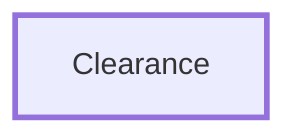

**How it moves**

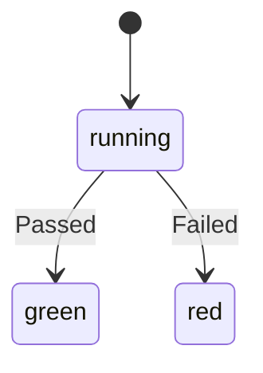

**Always true**

- A run says what it ran and what came back.

### All

Every CI run ever recorded, one per commit.

### Clearance given

Recorded after [Passed](#passed).

### Clearance refused

Recorded after [Failed](#failed).

### Clearance started

Recorded after [Start](#start).

### Commit ref

Text.

### Failed

Record that the suite went red against this commit. Done by the system.

### For

Is this exact commit cleared? Ask with the sha you are about to deploy; an empty answer is a no, including when nobody has run CI on it at all.

### Passed

Record that the suite went green against this commit. Done by the system.

### Red

Commits CI refused, with what it said.

### Run summary

Text.

Always true: a run says what it ran and what came back.

### Start

Put a commit through CI. Done by the qa engineer.

## Sweep

> One agent's pass over one chapter — every check it made, what each expected, and what actually came back.

Starts out sweeping. Can be sweeping, concluded, or abandoned.

**How it fits**

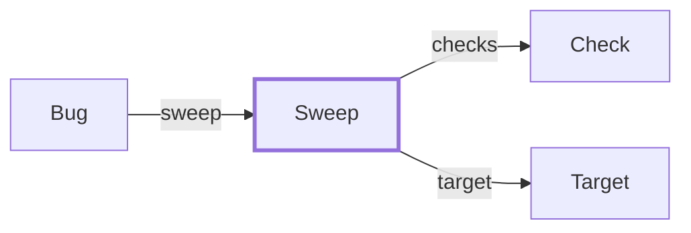

**How it moves**

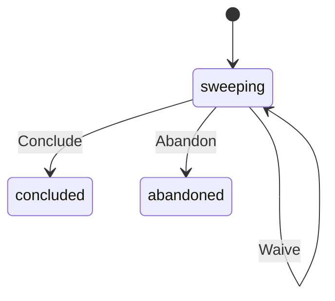

**Always true**

- A Sweep references a Target.
- A Sweep has many checks.
- A sweep is referenced.
- A sweep says who ran it.
- A check count is not negative.
- A waiver count is not negative.
- A sweep says what it learned, in at least 40 characters.
- A waived gate says why.
- A check sequence is positive.
- A check names what it put to the system.
- A check says what it expected.

### Abandon

End a pass whose output should not be trusted. Done by the qa engineer.

### All

Every pass ever made — what a runner mints the next reference from.

### Check

Put one thing to the system, saying what it should do before looking. Done by the qa engineer.

### Check

One dispatch made against a written-down expectation, and what actually came back.

Starts out made. Can be made, held, surprising, or unsettled.

### Check count

A whole number.

Always true: a check count is not negative.

### Check held

Recorded after [Held](#held).

### Check made

Recorded after [Check](#check).

### Check remade

Recorded after [Remake](#remake).

### Check sequence

A whole number.

Always true: a check sequence is positive.

### Check surprised

Recorded after [Surprised](#surprised).

### Check unsettled

Recorded after [Unsettled (check)](#unsettled-check).

### Conclude

End a pass and say what it taught. Done by the qa engineer.

### Engineer

Text.

Always true: a sweep says who ran it.

### Expectation

Text.

Always true: a check says what it expected.

### For subject

Everything ever put to one verb, across every sweep. Count the rows and that is its coverage.

### Gate waived

Recorded after [Waive (sweep)](#waive-1) or [Waive (bug)](#waive).

### Held

Record that the system did what the chapter promised. Done by the qa engineer.

### Listing

Text.

### Observation

Text.

### Open

Begin a pass over one chapter. Done by the qa engineer.

### Remake

Put a settled check back, against a system that has since changed. Done by the qa engineer.

### Subject

Text.

Always true: a check names what it put to the system.

### Surprised

Record that the system did something other than what was written down. Done by the qa engineer.

### Surprising

Every check the system surprised, across every sweep — the raw material a bug is written from, and the only list here that is supposed to be interesting.

### Sweep abandoned

Recorded after [Abandon](#abandon).

### Sweep concluded

Recorded after [Conclude](#conclude).

### Sweep notes

Text.

Always true: a sweep says what it learned, in at least 40 characters.

### Sweep opened

Recorded after [Open](#open-1).

### Sweep reference

Text.

Always true: a sweep is referenced.

### Sweeping

Passes live right now — one per agent, and the reason a target shows as held.

### Unsettled (check)

Record a check that ran and settled nothing. Done by the qa engineer.

### Unsettled (the list)

Made and never ruled on, plus the runs that settled nothing. A sweep concluded with rows here concluded early.

### Waive

Go round a gate, on the record. Done by the qa engineer.

### Waived

Sweeps that went round a gate. Read as a fraction of all of them: a practice whose waiver rate is climbing is not moving faster, it is agreeing with itself less.

### Waiver count

A whole number.

Always true: a waiver count is not negative.

### Waiver reason

Text.

Always true: a waived gate says why.

## Target

> A chapter that can be pressure-tested, and whose turn it is — the rotation, and the claim that stops two agents doing the same work twice.

Starts out waiting. Can be waiting, held, or shelved.

**How it fits**

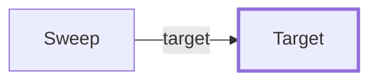

**How it moves**

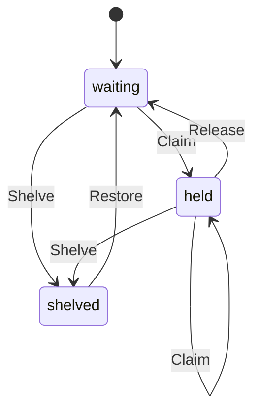

**Always true**

- A target is referenced.
- A target says where it is.
- An instant is not before the epoch.
- A sweep time is not before the epoch.
- Shelving a target says why.
- A staleness window is positive.

### All

Every chapter ever written down — the inventory a runner walking the repository checks its findings against.

### Claim

Take the next chapter in the rotation, or one whose holder has gone quiet. Done by the qa engineer.

### Engineer

Text.

### Held

Claimed right now, and by whom. Read it before wondering why the rotation looks short — a claim older than the window is free for the taking.

### Identify

Write down that a chapter exists which nobody has swept. Done by the qa engineer.

### Instant

A whole number.

Always true: an instant is not before the epoch.

### Release

Hand a chapter back to the rotation, stamped with when. Done by the qa engineer.

### Restore

Put a shelved chapter back in the rotation. Done by the qa engineer.

### Rotation

Whose turn it is — waiting chapters, least recently swept first. The one reason this aggregate exists.

### Shelve

Decide a chapter is not worth the practice's time, and say why. Done by the qa engineer.

### Shelved

Deliberately not swept, each with its reason. Re-read before anybody claims a coverage number.

### Stale after

A whole number.

Always true: a staleness window is positive.

### Swept in

A whole number.

Always true: a sweep time is not before the epoch.

### Target claimed

Recorded after [Claim](#claim-1).

### Target identified

Recorded after [Identify](#identify).

### Target path

Text.

Always true: a target says where it is.

### Target reason

Text.

Always true: shelving a target says why.

### Target reference

Text.

Always true: a target is referenced.

### Target released

Recorded after [Release](#release).

### Target restored

Recorded after [Restore](#restore).

### Target shelved

Recorded after [Shelve](#shelve).

### Untouched

Never swept at all — zero is the epoch and means nobody has looked. The gap no count of checks can show you, because an unswept chapter leaves no rows anywhere.

## Ticket

> One issue raised in a tracker outside this repository — what it says, whether the tracker took it, and how many times we have asked.

Starts out raised. Can be raised, submitting, filed, refused, abandoned, or closed.

**How it fits**

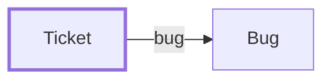

**How it moves**

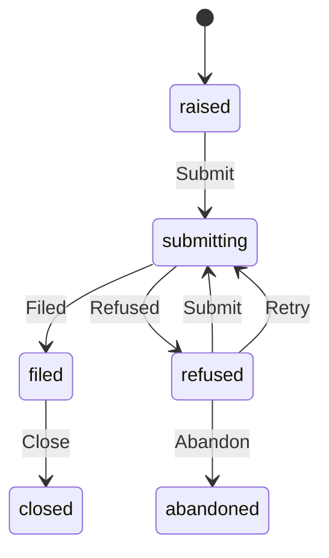

**Always true**

- A Ticket references a Bug.
- A ticket is referenced.
- A ticket is titled.
- A ticket says something.
- An issue number is not negative.
- An attempt count is not negative.
- A filing is attempted at least once.

### Abandon

Stop asking, and put it in front of a person. Done by the qa engineer.

### Abandoned

Asked three times, refused three times. Every row belongs in the report, because nothing automatic will touch it again.

### All

Every ticket ever raised.

### Ask again

When [Ticket filing refused](#ticket-filing-refused) happens, [Ticket](#ticket) is asked to [Retry](#retry).

### Ask once more

When [Ticket retried](#ticket-retried) happens, Ticket::issue tracker is asked to File.

### Attempt count

A whole number.

Always true: an attempt count is not negative.

### Bug ref

Text.

### Close

Record that the issue is done with. Done by the qa engineer.

### File when submitted

When [Ticket submitted](#ticket-submitted) happens, Ticket::issue tracker is asked to File.

### Filed

Record that the tracker took it, and where it landed. Done by the system.

### Filed (the list)

Open issues this practice is responsible for, out in the world.

### For bug

Every ticket ever raised about one bug — the duplicate check, before a second is raised.

### Issue number

A whole number.

Always true: an issue number is not negative.

### Issue url

Text.

### Max attempts

A whole number.

Always true: a filing is attempted at least once.

### Proposed

Tickets that already carry a pull request — a fix exists, so more work filed against them is duplicated effort.

### Pull request

Text.

### Raise

Say the outside world needs to know about a bug we could not fix. Done by the qa engineer.

### Raised

Composed and not sent. Nothing will happen to these until somebody submits one.

### Refusal text

Text.

### Refused

Record that the tracker would not take it, and what it said. Done by the system.

### Refused (the list)

The tracker said no, and what it said. Retried automatically until the cap.

### Resting on fixed

Tickets about a bug this repository went on to fix itself. Each one owes the outside world a Close.

### Resting on unpaused

Tickets about a bug nobody has stopped on. Raise an issue only for something you could not fix yourself — this is the list where that gets skipped.

### Retry

Ask again, up to the limit, carrying what was refused. Done by the system.

### Submit

Send it — the last reversible moment. Done by the qa engineer.

### Submitting

Sent and not yet answered. A row that sticks here is a call whose outcome nobody recorded — look at the tracker before asking again, or a retry files a duplicate.

### Ticket body

Text.

Always true: a ticket says something.

### Ticket closed

Recorded after [Close](#close).

### Ticket filed

Recorded after [Filed](#filed).

### Ticket filing abandoned

Recorded after [Abandon](#abandon-1).

### Ticket filing refused

Recorded after [Refused](#refused). Prompts [Ask again](#ask-again).

### Ticket raised

Recorded after [Raise](#raise).

### Ticket reference

Text.

Always true: a ticket is referenced.

### Ticket repository

Text.

### Ticket retried

Recorded after [Retry](#retry). Prompts [Ask once more](#ask-once-more).

### Ticket submitted

Recorded after [Submit](#submit). Prompts [File when submitted](#file-when-submitted).

### Ticket title

Text.

Always true: a ticket is titled.

## Roles

> Who does what. A role is named once here rather than under every term it touches.

### QA engineer

Responsible for [Identify](#identify), [Claim (target)](#claim-1), [Release](#release), [Shelve](#shelve), [Restore](#restore), [Open](#open-1), [Check](#check), [Waive (sweep)](#waive-1), [Conclude](#conclude), [Abandon (sweep)](#abandon), [Held](#held), [Surprised](#surprised), [Unsettled (check)](#unsettled-check), [Remake](#remake), [Log](#log), [Rank](#rank), [Tag](#tag), [Claim (bug)](#claim), [Drop](#drop), [Investigate (bug)](#investigate-1), [Fix](#fix), [Verify](#verify), [Pause](#pause), [Withdraw](#withdraw), [Regress](#regress), [Revisit](#revisit), [Waive (bug)](#waive), [Propose](#propose), [Investigate (angle)](#investigate), [Build](#build), [Discard](#discard), [Raise](#raise), [Submit](#submit), [Abandon (ticket)](#abandon-1), [Close](#close), and [Start](#start).

### System

Responsible for [Filed](#filed), [Refused](#refused), [Retry](#retry), [Passed](#passed), and [Failed](#failed).

## Read models

> Questions answered across more than one of the things above.

### Bugs by status

Every bug sorted into what became of it — the tally. The share that is withdrawn, beside the share verified, is the honesty check on the whole practice.

### Bugs by submitter

Every bug sorted by who reported it, then by its own reference — what each agent has actually found.

### Tickets by status

Every ticket sorted by where it got to — stuck filings and abandoned ones are only visible as a count.

## Reactions

> What happens on its own, in response to something this specification does not itself raise.

### Clear on pass

When Suite passed happens, [Clearance](#clearance) is asked to [Passed](#passed).

### Close when closed upstream

When Issue closed upstream happens, [Ticket](#ticket) is asked to [Close](#close).

### Record the issue

When Issue filed happens, [Ticket](#ticket) is asked to [Filed](#filed).

### Record the refusal

When Issue filing refused happens, [Ticket](#ticket) is asked to [Refused](#refused).

### Refuse on fail

When Suite failed happens, [Clearance](#clearance) is asked to [Failed](#failed).
